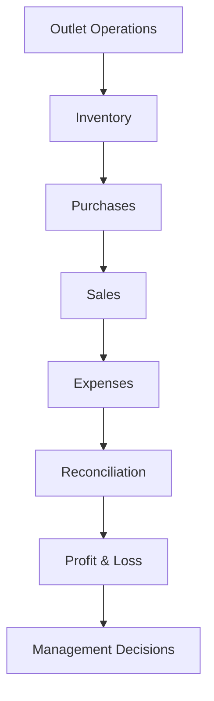
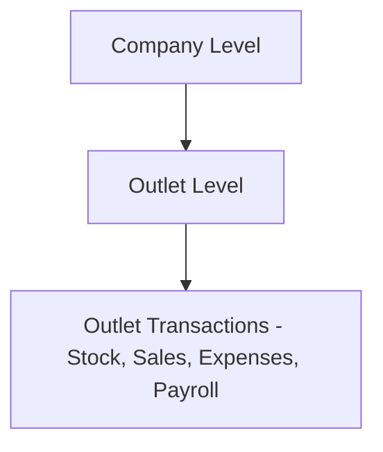
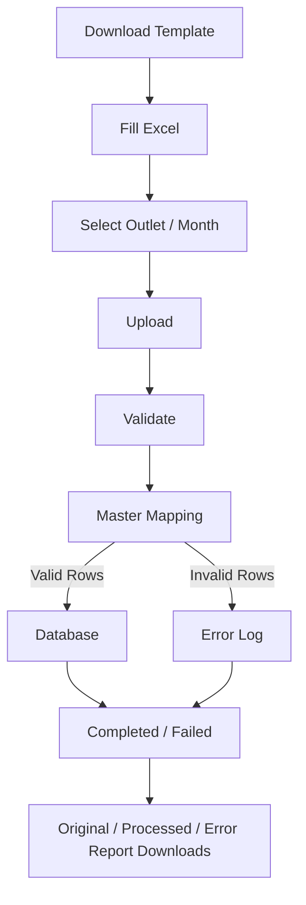
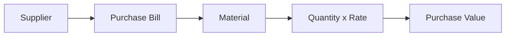
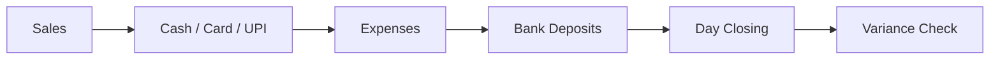
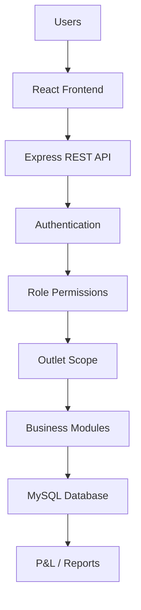
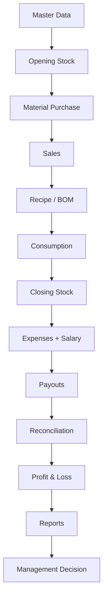

# BIG BEAN CAFÉ
## ERP, Inventory, Accounts & P&L Management System
### Comprehensive Project Report

---

## COVER

**BIG BEAN CAFÉ**

**ERP, INVENTORY, ACCOUNTS &**
**P&L MANAGEMENT SYSTEM**

**COMPREHENSIVE PROJECT REPORT**

**Prepared for:** Big Bean Café Management

**System:** Multi-Outlet ERP & Financial Management Platform

**Project Type:** Multi-Outlet Operations & Financial Management Software

**Current Project Status:** Core platform operational — foundation, security, daily accounts, stock, payroll, payouts, and P&L reporting are live in production use; purchase and sales upload modules are being brought up to full standard; theoretical-consumption/variance analytics are planned.

**Technology:** React + Node.js + Express + MySQL

---

## Table of Contents

1. Executive Summary
2. Project Vision
3. Problem Statement
4. Project Objectives
5. Software Users
6. Outlet Architecture
7. Complete Software Modules
8. Master Data Management
9. Excel Upload Workflow
10. Opening Stock
11. Closing Stock
12. Material Purchase
13. Supplier Management
14. Sales Management
15. Recipe / BOM
16. Inventory Consumption
17. Food Cost
18. Daily Outlet Accounts
19. Month-End Expenses
20. Payroll
21. Online & Dine-in Payouts
22. Profit & Loss Workflow
23. Management Dashboard
24. Reports
25. User Access & Security
26. Approval Workflow
27. Notification System
28. Audit System
29. Software Technology
30. System Architecture
31. Database Overview
32. Current Project Status
33. Project Completion Summary
34. Development Roadmap
35. What Management Can Do With This Software
36. Expected Business Benefits
37. Future Scope
38. Risks / Controls
39. Project Workflow Summary
40. Technical Appendix
41. Development Handover Notes
42. Conclusion

---

## 1. Executive Summary

Big Bean Café operates multiple café outlets, and until now, each outlet has tracked its stock, purchases, sales, and expenses largely through individual spreadsheets. This made it slow and error-prone for management to see how the business — or any single outlet — was actually performing.

**Big Bean Café ERP** is a purpose-built software platform that brings every outlet's day-to-day operations and monthly finances into one secure, centrally managed system. It is being developed specifically for Big Bean Café's operating model — not a generic off-the-shelf tool.

With this system, management can:
- See **inventory** (opening stock, purchases, closing stock) for every outlet in one place
- Track **sales** and reconcile them against online/aggregator settlements
- Monitor **expenses**, **salaries**, and **utility costs** month by month
- Calculate **food cost** and **Profit & Loss** per outlet, automatically
- Control exactly **who can see or change what**, by role and by outlet
- Rely on the system — not memory or paper trails — for **audit history**

The platform is built on modern, widely-supported technology (React, Node.js, MySQL) and is already handling several of these workflows in real use, with the remaining modules progressing toward the same standard. This report presents the system's current state, business value, and the plan to complete it — in plain business terms, backed by what has actually been built and verified in the codebase.

---

## 2. Project Vision

The long-term vision is **one centralized platform for every Big Bean Café outlet** — replacing scattered spreadsheets with a single source of truth that flows naturally from daily operations into management decisions.



Every outlet feeds the same system, using the same rules, so that comparing one outlet against another — or the whole chain against its targets — becomes a matter of opening a report, not compiling spreadsheets.

---

## 3. Problem Statement

**Before this system, Big Bean Café faced challenges common to growing multi-outlet food businesses:**

- Stock, purchase, and sales data lived in **separate Excel files per outlet**, in inconsistent formats
- Head office had to **manually consolidate** numbers from every outlet before any company-wide view was possible
- **Consumption** (how much raw material was actually used) was difficult to calculate reliably
- **Food cost** — one of the most important numbers in any café business — could not be tracked consistently outlet-to-outlet
- **Comparing outlets** against each other was slow and manual
- **Supplier and purchase tracking** had no single ledger tying purchases to payments
- **Aggregator settlements** (online orders, dine-in portals) were hard to verify against what was actually received
- **Expenses** across outlets were not consolidated into one monthly view
- **Monthly P&L** preparation was a manual, time-consuming exercise, redone every month
- Manual processes carried a **real risk of data entry errors**
- There was **no consistent access control** — anyone with the spreadsheet could see or change anything
- There was **no audit trail** showing who changed what, and when

**How this ERP solves them:** every one of these problems maps directly to a module already built or in progress in the system — standardized Excel uploads with validation, master-data-driven consistency, role- and outlet-based access control, automatic food-cost and P&L calculation, and a built-in audit log. The remaining sections of this report walk through exactly how.

---

## 4. Project Objectives

- Centralize operations across all outlets into one platform
- Give management multi-outlet control from a single login
- Improve data accuracy through validation and master-data mapping
- Standardize how every outlet uploads stock, purchase, and sales data
- Monitor stock levels and stock value per outlet
- Monitor purchases and supplier activity
- Monitor sales and reconcile aggregator settlements
- Monitor daily and monthly expenses
- Track payroll cost per outlet
- Calculate food cost automatically, every month
- Produce a monthly Profit & Loss statement per outlet
- Enable outlet-to-outlet comparison
- Maintain a full audit trail for financial actions
- Deliver real-time management reporting
- Enforce strong, role-based and outlet-based security

---

## 5. Software Users

The system is built around real Big Bean Café roles, defined in the platform's own user database:

| User Type | Who They Are | What They Use the System For |
|---|---|---|
| **Management (Super Admin / Admin / Developer)** | Owners, senior management, technical leadership | Full visibility across all outlets; approve, verify, and lock financial records; manage users, roles, and master data; view company-wide P&L |
| **Outlet Admin** | Outlet manager | Runs their outlet's day-to-day records — daily cashbook, expenses, day closing, bank deposits; views stock/purchase/sales activity for their outlet |
| **Outlet Staff** | Front-line outlet team member | Records daily cash expenses and views their outlet's dashboard; no access to sensitive financial approvals |
| **Viewer** | Auditor / read-only stakeholder | Can view and export reports across all outlets, but cannot create, edit, approve, or delete anything |
| **Developer / Technical Team** | IT/technical maintainers | Full system access for support, configuration, and future development |

Every user is assigned a role **and** an outlet (or "all outlets," for management-level roles). Both are checked by the system on every action — described further in [Section 25](#25-user-access--security).

---

## 6. Outlet Architecture

Big Bean Café currently operates **7 outlets**, each configured as its own outlet record in the system: RR Nagar, Koramangala, M5 E-City Mall, HSR Layout, Jayanagar, Indiranagar, and Kammanahalli.



- **Super Admin / Admin / Developer / Viewer** can view **all outlets**, or focus on one specific outlet at a time via the outlet selector.
- **Outlet Admin / Outlet Staff** are locked to their **assigned outlet only** — they cannot even request another outlet's data.
- This restriction is enforced on the **backend server**, not just hidden in the screen design — so even a technically skilled user cannot bypass it by editing the page or the request. This is the system's real security boundary, detailed in [Section 25](#25-user-access--security).

---

## 7. Complete Software Modules

| Module | Purpose | Current Status | Business Benefit |
|---|---|---|---|
| Dashboard | At-a-glance outlet/company summary | ✅ Completed | Instant visibility into sales, cost, and profit |
| User Management | Create/manage staff accounts | ✅ Completed | Controlled onboarding/offboarding |
| Role Access | Define what each role can do | ✅ Completed | Fine-grained permission control |
| Masters (Outlets, Categories, Suppliers, Raw Materials, Units, Menu Items) | Foundational reference data | ✅ Completed | Consistent naming/data across all outlets |
| Daily Cashbook | Daily cash position per outlet | ✅ Completed | Daily cash accountability |
| Daily Cash Expenses | Small daily outlet expenses | ✅ Completed | Expense visibility and control |
| Bank Deposits | Cash-to-bank deposit tracking | ✅ Completed | Cash reconciliation |
| Day Closing / Daily Checklist | End-of-day summary | ✅ Completed | Daily operational discipline |
| Utility Bills | Monthly electricity/water/etc. | ✅ Completed | Monthly overhead visibility |
| Employee Salary (Payroll) | Monthly staff cost per outlet | ✅ Completed | Payroll cost control |
| Opening Stock | Start-of-month inventory | ✅ Completed | Accurate stock baseline |
| Closing Stock | End-of-month inventory | ✅ Completed | Accurate consumption & COGS |
| Material Purchase | Supplier purchases | 🟡 In Progress | Purchase visibility (validation being hardened) |
| Supplier Payments | Payments to suppliers | ✅ Completed | Vendor payment tracking |
| Item-wise Sales Upload | Simple sales upload | 🟡 In Progress | Alternate sales data path (not yet in P&L) |
| Daily / Monthly Sales Upload (PetPooja) | Reconciled sales pipeline | ✅ Completed | This is the sales data that drives the live P&L |
| Recipe / BOM | Menu item ingredient lists | ✅ Completed (core) | Foundation for future consumption analytics |
| Online Payouts | Aggregator settlement tracking | ✅ Completed | Settlement mismatch visibility |
| Dine-in Payouts | Dine-in portal settlement tracking | ✅ Completed | Settlement mismatch visibility |
| Reports (P&L, Consumption, Cashbook, Expense) | Management reporting | ✅ Completed | Data-driven decisions |
| Monthly P&L | Outlet-level profit & loss | ✅ Completed | The single most important number for management |

---

## 8. Master Data Management

The system relies on a set of shared reference lists — **masters** — that every module reads from: **Outlets, Categories, Suppliers, Raw Materials, Units, Menu Items, Expense Heads, Online Platforms, Dine-in Portals**.

In plain terms: instead of typing internal database codes, an outlet team member simply types a **name** they recognize — and the system does the matching in the background.

**Example:**

```
User enters:  COCOA DUST
System maps:  Raw Material ID → Code → Category → Unit
```

This matters because:
- Outlet staff should never need to know or type internal database IDs
- The same material name always resolves to the same internal record, no matter who typed it or at which outlet
- If a name doesn't match anything in the masters, the system flags it as an error instead of silently accepting bad data

---

## 9. Excel Upload Workflow

Every stock, purchase, and sales module follows the same standardized upload process:



**Why this matters:**
- **Prevents bad data** from ever reaching the database — invalid rows are rejected, not silently stored
- **Easier correction** — the Error Report tells the outlet exactly which rows failed and why
- **Full traceability** — every upload keeps its original file, its successfully processed rows, and its error log
- **Consistent format** across every outlet, every month
- **Less manual work** — no more hand-consolidating spreadsheets at head office

---

## 10. Opening Stock

**Purpose:** records the inventory value at the **start** of each month, per outlet.

**Input:** Date, Material Name, Quantity, Unit, Rate, Remarks.

**Validation:** every row is checked against the material and unit masters before being accepted; rows that don't match a known material or unit are rejected and logged for correction — the system never guesses.

**Value formula:**
```
Opening Stock Value = Qty × Rate
```
(calculated automatically by the database — never manually entered)

**Current Status: ✅ Completed** — verified against both the code and, in this project's most recent working session, against live data (a real uploaded file's date was independently confirmed to match the source database exactly).

**Available downloads:** Original file, Processed report, Error report, and a ready-to-use Download Template.

**Example template title:**
```
BIG BEAN CAFE - OPENING STOCK - AUGUST 2026
```

---

## 11. Closing Stock

**Purpose:** records the physical inventory value at the **end** of each month, per outlet — the counterpart to Opening Stock.

**Value formula:**
```
Closing Stock Value = Qty × Rate
```

**Validation & mapping:** identical standard to Opening Stock — every material and unit is checked against the masters; unmatched rows are rejected and logged with a clear reason.

**Timezone-safe date handling:** this module was specifically verified and fixed this project cycle to ensure the date shown in downloaded reports **exactly matches** the date stored in the database — a subtle technical issue (a one-day shift caused by timezone conversion) was identified and corrected, then confirmed against a live record.

**Current Status: ✅ Completed and runtime-verified** — both the processed-file date export and the error-report formatting (column widths, readability, date/time display) were independently tested against real uploaded data this cycle and confirmed correct.

**Available downloads:** Original file, Processed report, Error report, dynamic Download Template.

**Example template title:**
```
BIG BEAN CAFE - CLOSING STOCK - AUGUST 2026
```

---

## 12. Material Purchase

**Purpose:** records raw material purchases from suppliers, which increase outlet inventory.



**Input format currently used:** Date, Supplier, Material, Qty, Unit, Rate, Amount, Bill No, Remarks.

**CURRENT STATUS: 🟡 IN PROGRESS**

**What already exists:**
- Excel upload works and successfully records purchase data
- Purchase history and per-outlet view are functional
- Purchase values already flow correctly into the Food Cost / P&L calculation

**What remains before this module reaches the same standard as Opening/Closing Stock:**
- Supplier, Material, and Unit name matching is currently **optional** rather than strictly enforced — a purchase row can be saved even if the supplier or material name doesn't exactly match a master record, which is a data-quality gap compared to the stricter Stock modules
- Original file, Processed report, Error report, and a Download Template are **not yet available** for this module

This module is deliberately **not marked as completed**, in line with actual verified code behavior.

---

## 13. Supplier Management


- **Supplier Master:** ✅ Completed — suppliers are registered once and reused across all purchase records.
- **Supplier Payments:** ✅ Completed — payments to suppliers are recorded, including proof-of-payment upload.
- **Outstanding Balance View:** ⚪ Planned — the calculation logic exists on the backend, but there is currently no dedicated screen showing suppliers their pending balance; this is a near-term addition, not yet delivered to users.

---

## 14. Sales Management

There are currently **two** sales data paths in the system:

1. **Item-wise Sales Upload** (🟡 In Progress) — a simpler Excel upload for item-level sales, similar in structure to the stock uploads. This data is recorded but **does not yet feed into the Profit & Loss calculation**.
2. **PetPooja Sales / Reconciliation** (✅ Completed) — a more mature pipeline with its own approval process (uploaded → reconciled → approved/rejected). **This is the sales data source that actually drives the live P&L today.**

In short: management's P&L numbers today are built on the PetPooja sales pipeline, not the simpler Item-wise Sales upload — the latter is an additional data-capture module still being matured.

---

## 15. Recipe / BOM

**Purpose:** defines exactly which raw materials — and how much of each — go into a single menu item.


**Example:**
```
Cappuccino
  - Coffee Beans
  - Milk
  - Sugar
```

**Business purpose:** once every menu item has a defined recipe, the system can calculate how much raw material *should* have been used based on what was actually sold — the foundation for theoretical consumption analysis (see next section).

**Current Status: ✅ Core recipe creation/editing implemented.** The consumption calculation that uses these recipes against actual sales is not yet built — see [Section 16](#16-inventory-consumption).

---

## 16. Inventory Consumption

**ACTUAL CONSUMPTION** — ✅ **Completed and already used in reporting/P&L today:**

```
Opening Stock + Purchases − Closing Stock = Actual Consumption
```

**THEORETICAL CONSUMPTION** — ⚪ **Planned, not yet built:**

```
Item Sales × Recipe BOM = Theoretical Consumption
```

**VARIANCE** — ⚪ **Planned, not yet built:**

```
Actual Consumption − Theoretical Consumption = Variance
```

**What Variance would tell management, once built:**
- **Wastage** — material lost in preparation
- **Over-portioning** — staff using more than the recipe specifies
- **Missing stock** — unexplained shrinkage
- **Recipe mismatch** — recipes that no longer reflect real usage
- **Pilferage** — theft or unauthorized use
- **Operational inefficiency** — general process issues

**Clear status:** Actual Consumption is fully working today and already informs food cost and P&L. Theoretical Consumption and Variance are **planned** — the database structure to support them exists, but the calculation logic itself has not yet been built. This is one of the most valuable near-term additions to the system.

---

## 17. Food Cost

**This is one of the most important numbers for a café business.**

```
Food Cost % = (Actual Consumption ÷ Sales) × 100
```

**Why it matters:** food cost is typically the single largest controllable expense in a café, after rent and salary. Tracking it every month, per outlet, lets management catch pricing problems, wastage, or portioning issues quickly — before they quietly erode profit.

**Outlet-wise comparison:** because every outlet now reports through the same system with the same formula, food cost percentage can be compared side-by-side across all 7 outlets — something that was previously very difficult to do consistently.

**Current Status: ✅ Completed** — this calculation runs automatically as part of the live Monthly P&L, using Adjusted Sales (net sales after aggregator deductions) as the sales figure.

---

## 18. Daily Outlet Accounts

**Modules:** Daily Cashbook, Daily Cash Expenses, Bank Deposits, Day Closing, Daily Checklist.



**Current Status: ✅ Completed**, with a formal approval workflow in place for cashbook, expenses, and day closing (see [Section 26](#26-approval-workflow)). This gives outlet managers a structured daily routine and gives head office confidence that daily numbers have been checked, not just entered.

---

## 19. Month-End Expenses

**Utility Bills:** electricity, water, internet, gas, maintenance, garbage, and other monthly costs — recorded per outlet, per month, with a Draft → Submitted → Verified approval flow.

**Salary:** covered separately in [Section 20](#20-payroll), as its own dedicated module.

**Other fixed costs (Rent, Marketing):** ⚪ Planned — these are recognized in the P&L design, but there is currently no dedicated entry screen for them; they are a near-term addition.

**How this feeds the P&L:** Utility Bills' monthly total flows directly into the outlet's total operating expenses in the P&L calculation.

---

## 20. Payroll

**Fields tracked per outlet, per month:** Total Employee Salary, Incentive/Bonus, Staff Accommodation, Other Staff Cost — combined automatically into a Total Salary Cost.

**Workflow:** Draft → Submitted → Verified, matching the same approval discipline used elsewhere in the system.

**Current Status: ✅ Completed** — including a verification step that was specifically fixed to work correctly during this project's development.

---

## 21. Online & Dine-in Payouts

**Purpose:** tracks money expected from — and actually received from — online ordering platforms and dine-in reservation/discovery portals.

```
Customer Paid
− Commission
− Taxes / Charges
= Expected Payout

Actual Payout − Expected Payout = Difference
```

**Business value:** the moment the actual amount received is entered, the system automatically calculates whether it matches what was expected — instantly surfacing any settlement shortfall from an aggregator, without manual spreadsheet comparison.

**Current Status: ✅ Completed** for both Online and Dine-in payout tracking. A fully dedicated "reconciliation dashboard" beyond this list-with-difference view is a future enhancement, not yet built.

---

## 22. Profit & Loss Workflow

This is the most important output of the entire system for management.

```
NET SALES
    ↓
LESS: FOOD COST / COGS
    ↓
GROSS PROFIT
    ↓
LESS:
  Salary
  Utilities
  Daily Expenses
  Platform Charges (online/dine-in deductions)
    ↓
NET PROFIT
```

| P&L Component | Source Module | Status |
|---|---|---|
| Net Sales / Gross Sales / Tax | PetPooja Sales pipeline (approved uploads only) | ✅ Completed |
| Food Cost / COGS (Opening + Purchases − Closing Stock) | Opening Stock, Material Purchase, Closing Stock | ✅ Completed |
| Salary | Payroll | ✅ Completed |
| Utilities | Utility Bills | ✅ Completed |
| Daily Expenses | Daily Cash Expenses | ✅ Completed |
| Platform Charges | Online & Dine-in Payouts | ✅ Completed |
| Rent / Marketing / other fixed costs | — | ⚪ Planned — no entry screen exists yet |
| Saved/"locked" monthly P&L snapshot | — | ⚪ Planned — the P&L is currently calculated live every time it's viewed, rather than saved as a finalized monthly record |

**Important note for management:** Rent and Marketing are **not yet** part of the automatically calculated Net Profit figure, because there is no data-entry module for them yet. Today's Net Profit figure should be read as *"profit before rent/marketing"* until that module is added.

---

## 23. Management Dashboard

The dashboard gives an at-a-glance summary, viewable for **all outlets combined** or for **one specific outlet**, depending on the user's role:

- Gross Sales, Net Sales, Tax
- Opening Stock, Purchases, Closing Stock
- Consumption (Food Cost basis)
- Food Cost %
- Salary Cost
- Daily Expenses
- Platform Charges
- Net Profit
- Pending Uploads (a count of stock/purchase uploads still awaiting completion)

**All-outlet vs. outlet-specific:** management-level roles can toggle between a company-wide view and any individual outlet; outlet-level staff only ever see their own outlet's numbers.

---

## 24. Reports

| Report | Purpose | Current Status |
|---|---|---|
| Monthly Outlet P&L | Full profit & loss per outlet, per month | ✅ Completed |
| Actual Consumption Report | Raw material consumption per outlet | ✅ Completed |
| Daily Cashbook Report | Consolidated daily cash view | ✅ Completed |
| Expense Report | Consolidated expense view | ✅ Completed |
| Theoretical Consumption Report | Recipe-based expected consumption | ⚪ Planned — screen not yet built |
| Supplier Pending Report | Supplier outstanding balances | ⚪ Planned — screen not yet built |
| Multi-outlet Comparison Dashboard | Side-by-side outlet comparison | ⚪ Planned |

---

## 25. User Access & Security

In plain terms:

- **ROLE = WHAT** a user is allowed to do (view, create, edit, delete, upload, approve, etc.)
- **OUTLET ASSIGNMENT = WHICH** outlet's data that user can see
- **THE BACKEND SERVER IS THE FINAL CHECKPOINT** — the screen may hide a button from a user who shouldn't see it, but even if that button were somehow shown, the server independently re-checks the user's role and outlet before allowing anything to happen. This is the real security boundary.

**Key protections already built in:**
- **Secure login (JWT):** every session is authenticated with an industry-standard secure token; the server re-verifies the user's identity on every single request, not just at login.
- **Role permissions:** every action in every module is individually switchable per role — view, create, edit, delete, upload, submit, verify, approve, reject, lock, export.
- **Outlet scope:** outlet-level staff are physically prevented — at the server level — from requesting another outlet's data.
- **Read-only users:** the Viewer role can look and export, but is blocked from making any change, anywhere.
- **Self-approval restriction:** a user can never approve or verify their own submitted entry — a second, different person must sign off.
- **Record locking:** once a financial record is verified/locked, it cannot be edited except by the most senior role, under an "emergency correction" permission.
- **Audit logs:** significant actions are recorded with who did what, when, and from where.

---

## 26. Approval Workflow

Where implemented, financial records move through a controlled sequence:

```
Draft → Submitted → Verified / Approved → Locked
```

**Why this matters for financial data:** a single person entering and approving their own numbers is a control weakness. By requiring a second person to verify or approve, and by locking a record once it's finalized, the system builds in the same checks-and-balances a good manual accounting process would require — automatically, every time.

**Currently implemented for:** Daily Cashbook, Day Closing, Daily Cash Expenses (approve/reject), Utility Bills, Payroll, and PetPooja Sales (upload → reconciled → approved/rejected → locked).

---

## 27. Notification System

**Status: ✅ Completed.**

The system automatically notifies relevant users when something important happens — an upload finishes (with how many rows succeeded or failed), a submission is made, or an approval/verification/rejection occurs on financial data.

- Notifications are shown with a clear **unread count**, and clicking one takes the user directly to the relevant page.
- Users can mark a single notification as read, or clear all of them at once.
- The system avoids spamming users with duplicate notifications for the same event within a short window.

---

## 28. Audit System

**Status: ✅ Implemented for key actions (login, password change, and other tracked modules); coverage will continue to expand as remaining modules mature.**

The system is built to record:
- **Who** performed an action
- **What** was changed
- **When** it happened
- **Which outlet** it relates to
- **Old and new values**, where captured

**Why management needs this:** in any financial system, being able to answer "who changed this number, and when" is not optional — it's the basis of trust in the numbers being reported. The audit log gives Big Bean Café that answer without relying on memory or informal record-keeping.

---

## 29. Software Technology

| Layer | Technology |
|---|---|
| Frontend | React + Vite |
| Backend | Node.js + Express |
| Database | MySQL |
| Security | JWT + Role-Based Permissions |
| Excel Handling | XLSX + ExcelJS |
| Charts | Recharts |
| UI Styling | Tailwind CSS |

All of the above are actively used, verified dependencies of the project — nothing here is aspirational. Detailed version numbers are kept in the [Technical Appendix](#40-technical-appendix) for the IT/developer audience.

---

## 30. System Architecture



Every request from a user's browser passes through authentication, then role-permission checks, then outlet-scope checks, before it's allowed to touch any business data — this order is fixed and cannot be skipped.

---

## 31. Database Overview

The system's database currently holds **56 tables**, grouped by business function:

| Group | Covers |
|---|---|
| **Masters** | Outlets, Categories, Suppliers, Raw Materials, Units, Menu Items, Expense Heads, Platforms, Portals |
| **Daily Operations** | Daily Cashbook, Daily Cash Expenses, Bank Deposits, Day Closing |
| **Stock** | Opening Stock, Closing Stock (upload batches + line items) |
| **Purchases** | Material Purchase, Supplier Payments |
| **Sales** | Item-wise Sales, PetPooja Sales & Reconciliation |
| **Expenses & Payroll** | Utility Bills, Employee Salary |
| **Payouts** | Online Payouts, Dine-in Payouts |
| **Reports & P&L** | Monthly P&L Snapshots |
| **Security** | Roles, Users, User-Outlet Assignments, Role Permissions |
| **Notifications** | Notification records |
| **Audit** | Audit Logs, Upload Error Logs, Approval Logs |

A full technical table-by-table breakdown is intentionally kept out of this management report — see `README.md` for the complete developer-level schema documentation.

---

## 32. Current Project Status

**✅ Completed**
- Authentication, Role Permissions, Outlet Security
- Masters (Outlets, Categories, Suppliers, Raw Materials, Units, Menu Items)
- Daily Outlet Accounts (Cashbook, Expenses, Bank Deposits, Day Closing, Checklist)
- Opening Stock
- Closing Stock (including this cycle's verified date-export and error-report fixes)
- Payroll (Employee Salary)
- Utility Bills
- Online Payouts & Dine-in Payouts
- Supplier Payments
- Recipe / BOM (core creation/editing)
- Notification System
- Monthly P&L, Actual Consumption Report, Daily Cashbook Report, Expense Report
- PetPooja Sales pipeline (the sales source feeding the live P&L)

**🟡 In Progress**
- Material Purchase (upload works; master-data validation and downloads still need hardening)
- Item-wise Sales Upload (upload works; not yet connected to P&L)
- Supplier Pending Report (calculation exists; no screen yet)
- Theoretical Consumption Report (screen registered; no calculation built)
- Company-wide outlet comparison dashboard

**⚪ Pending**
- Theoretical Consumption & Variance calculation
- Saved/"locked" monthly P&L snapshots (currently calculated live, not stored)
- Rent, Marketing, and other fixed-cost entry
- Formal, scheduled database backup policy

**🔴 Known Issues**
- Two unexpected role entries exist in the system's role list that are outside the intended design and should be reviewed/cleaned up
- Material Purchase and Item Sales currently accept a row even when the material/supplier name doesn't exactly match a master record — a data-quality gap relative to the stricter Stock modules

---

## 33. Project Completion Summary

Rather than a single, potentially misleading completion percentage, the project's progress is best understood across five layers:

| Layer | Progress |
|---|---|
| **Core Foundation** (auth, roles, permissions, outlet security, masters) | ✅ Strong — fully built and in active use |
| **Operational Modules** (daily accounts, stock, payroll, utilities, payouts) | ✅ Strong — fully built, several independently verified this cycle |
| **Financial Modules** (purchases, supplier payments, sales) | 🟡 Moderate — supplier payments complete; purchase and sales uploads still maturing |
| **Reporting** (P&L, consumption, cashbook, expense reports) | ✅ Strong — core reports live and used |
| **Advanced Analytics** (theoretical consumption, variance, multi-outlet comparison, forecasting) | ⚪ Early — foundation exists, calculation logic not yet built |

**In short:** the operational backbone of the business is on solid ground; the next major push is in tightening the purchase/sales data pipeline and building out the analytics layer on top of the already-working foundation.

---

## 34. Development Roadmap

| Phase | Focus | Status |
|---|---|---|
| Phase 1 — Foundation & Security | Auth, roles, permissions, outlet scope | ✅ Completed |
| Phase 2 — Inventory | Opening Stock, Closing Stock | ✅ Completed |
| Phase 3 — Purchases | Material Purchase, Supplier Payments | 🟡 In Progress |
| Phase 4 — Sales | Item Sales Upload, PetPooja Sales | 🟡 In Progress (PetPooja mature; Item Sales maturing) |
| Phase 5 — Recipe & Consumption | Recipe/BOM, Actual/Theoretical Consumption, Variance | 🟡 In Progress (Actual done; Theoretical/Variance planned) |
| Phase 6 — Accounts & Expenses | Daily Accounts, Utility Bills, Payroll | ✅ Completed |
| Phase 7 — Reconciliation | Payout reconciliation, Supplier outstanding | 🟡 In Progress |
| Phase 8 — P&L | Live Monthly P&L calculation | ✅ Completed (live calculation); ⚪ Planned (saved snapshots) |
| Phase 9 — Reports & Analytics | Core reports, multi-outlet comparison, forecasting | 🟡 In Progress (core done; comparison/forecasting planned) |
| Phase 10 — Hardening / Production | Backup policy, full audit coverage, remaining approval/lock workflows | ⚪ Planned |

---

## 35. What Management Can Do With This Software

**Available Now:**
- Check individual outlet performance in real time
- Compare food cost and expenses across outlets manually via reports
- Monitor purchases as they are recorded
- Monitor opening and closing stock values
- Track daily and monthly expenses, including salary and utilities
- Check aggregator payout differences (expected vs. actual)
- See a live, automatically calculated monthly P&L per outlet
- Monitor which uploads are pending or incomplete
- Control exactly what each staff member and outlet can access
- Review audit history for tracked actions

**Planned / Upcoming:**
- Automatic outlet-vs-outlet comparison dashboard
- Theoretical consumption and wastage/variance alerts
- A dedicated supplier outstanding-balance view
- Finalized, "locked" monthly P&L snapshots that don't change after month-close
- Rent/marketing cost entry feeding directly into Net Profit

---

## 36. Expected Business Benefits

- **Better cost control** through consistent, outlet-wide food-cost tracking
- **Faster monthly closing** — numbers are already structured, not re-compiled from scratch
- **Lower manual work** across every outlet's reporting cycle
- **Fewer Excel-driven mistakes**, thanks to built-in validation
- **Better stock control** through consistent opening/closing stock discipline
- **More accurate food cost**, calculated the same way, every outlet, every month
- **Clearer profitability visibility**, outlet by outlet
- **Faster management decisions**, backed by real-time data instead of month-end spreadsheets
- **Stronger accountability**, through role-based access and audit history
- **Scalability** — adding a new outlet means adding one record, not building a new spreadsheet system

---

## 37. Future Scope

- Advanced theoretical consumption and automatic variance alerts
- A dedicated supplier outstanding-balance dashboard
- Company-wide, side-by-side outlet comparison views
- More automated aggregator/payout reconciliation
- Budget vs. Actual tracking
- Sales targets and forecasting
- Mobile-friendly outlet operations
- Automatically scheduled report delivery
- Executive-level summary dashboards

All of the above are **future scope** — none are currently built, and this report does not claim otherwise.

---

## 38. Risks / Controls

| Risk | Control |
|---|---|
| Wrong or inconsistent Excel data | Row-level validation with a downloadable Error Report showing exactly what failed and why |
| Unauthorized access to another outlet's data | Outlet Scope — enforced on the server, not just hidden in the interface |
| Unauthorized actions by staff | Role-based permissions, individually switchable per action, per module |
| Changes made after financial approval | Record locking — locked records can only be changed by the most senior role, under an explicit emergency-correction permission |
| Incorrect material/supplier mapping | Master-data validation (fully enforced today in Stock modules; being extended to Purchases/Sales) |
| Loss of database data | Backup strategy (recommended discipline — see [Section 41](#41-development-handover-notes)) |
| Exposure of passwords/secrets | All credentials are kept in environment configuration, never in code, and are never displayed in any report or screen |

---

## 39. Project Workflow Summary



This is the complete journey of data through the system — from a raw material name entered by an outlet, all the way to a management decision made from a P&L report. Every stage in this chain is either already built and in use, or is a clearly identified next step on the roadmap above.

---

## 40. Technical Appendix

*(For IT/Developer reference — full detail available in the project's `README.md`.)*

**Frontend stack:** React 18, Vite 5, React Router 6, Axios, Zustand, Tailwind CSS 3, Recharts, Lucide icons, react-hot-toast.

**Backend stack:** Node.js, Express 4, MySQL driver (mysql2), JSON Web Tokens, bcrypt password hashing, Multer (file uploads), XLSX + ExcelJS (Excel read/write), Helmet + rate limiting (security), Morgan (logging).

**Database:** MySQL 8, database name configured via environment variable, 56 tables currently defined.

**Key directories:** `backend/src/controllers`, `backend/src/routes`, `backend/src/middleware`, `frontend/src/pages`, `frontend/src/layouts`, `database/` (schema + migrations).

**Environment variable names only** (no values shown): `NODE_ENV`, `PORT`, `DB_HOST`, `DB_USER`, `DB_PASSWORD`, `DB_NAME`, `DB_PORT`, `JWT_SECRET`, `JWT_EXPIRE`, `UPLOAD_PATH`, `MAX_FILE_SIZE`, `FRONTEND_URL`, `VITE_API_URL`.

**Development URLs:** Frontend on port 5173; Backend API on port 5001 (configurable).

**Major API groups:** Authentication, Masters, Daily Accounts, Uploads (Stock/Purchase/Sales), Reports, Recipes, Payouts, Supplier Payments, Payroll, Utility Bills, Sales (PetPooja), Dashboard, Notifications, Users/Roles.

**Installation overview:** install dependencies for both `backend/` and `frontend/` via `npm install`; configure `.env` files (never committing real secrets); import the base schema and migrations into a fresh MySQL database; run backend (`npm run dev`) and frontend (`npm run dev`) separately.

---

## 41. Development Handover Notes

- The **backend server is the final authorization layer** — it must never simply trust data sent from the browser, especially which outlet a request claims to be for.
- **Master data references must never be silently left blank** — if a module is meant to reach full validation standard, an unmatched name should be rejected, not saved with a missing link.
- **Every failed upload row must be logged** to the system's error log — never silently dropped.
- **Every download must respect outlet security** — a user should never be able to download data outside their assigned outlet.
- **Credentials must be protected** — no password, secret key, or token should ever appear in code, reports, or shared documents.
- **Never re-run first-time database setup scripts** against a database that already contains live data — always back up first.
- **Always back up the database before applying any update** to its structure.

---

## 42. Conclusion

Big Bean Café ERP is steadily becoming the centralized operational and financial control platform the business needs — one that connects **Operations, Inventory, Purchases, Sales, Expenses, Payroll, Payouts, Food Cost, and Profit & Loss** into a single, secure system, instead of leaving them scattered across individual outlet spreadsheets.

The foundation — security, daily operations, stock management, payroll, payouts, and live P&L reporting — is complete and already delivering value. The next phase of work is focused and well-defined: hardening the purchase and sales upload pipeline to the same standard as stock, and building the consumption-variance analytics layer that will give management its clearest possible view into wastage, portioning, and cost control.

This report reflects the system's **actual, current state** — nothing here has been claimed as complete unless it was verified against the real codebase, database, or a live test during development. That discipline is intentional: a management report on a financial system is only useful if it can be trusted.

---

*Prepared from direct inspection of the Big Bean Café ERP codebase, live database schema, and (where noted) verified runtime results. For full technical documentation, see `README.md` in the project root. No credentials, secrets, or tokens are disclosed in this report.*
