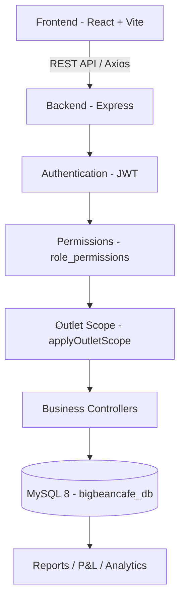
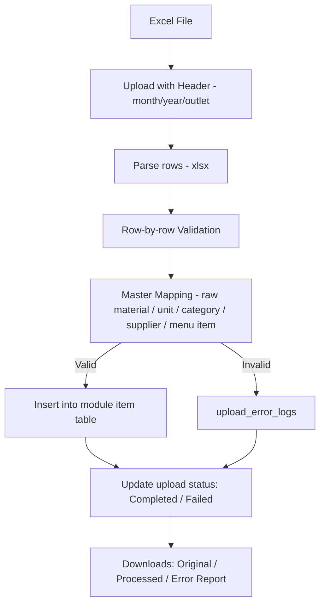
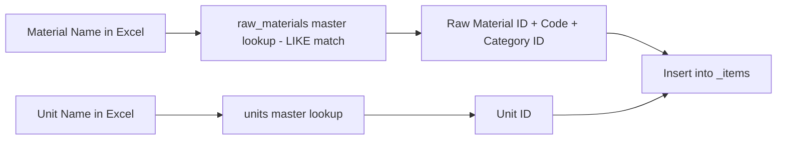
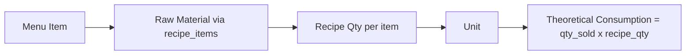
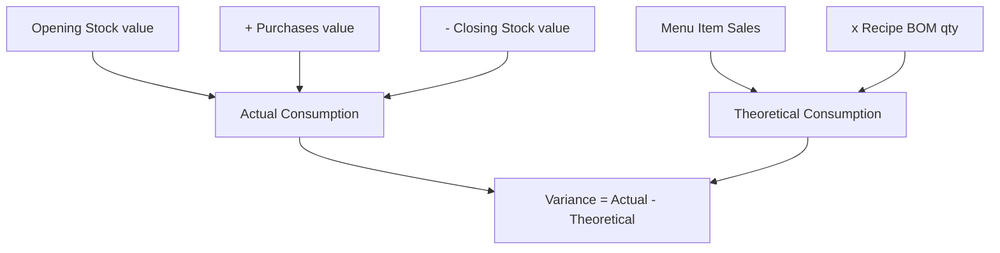
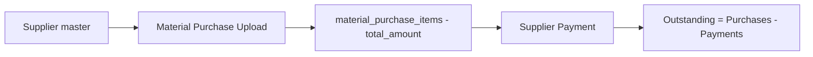
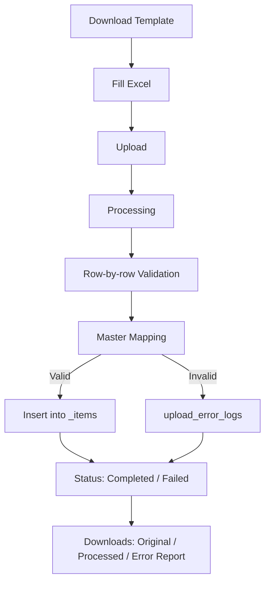
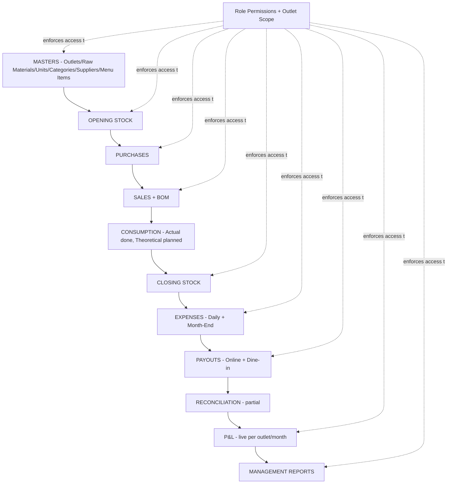

# BIG BEAN CAFÉ
### ERP, Inventory, Accounts & P&L Management System

> A multi-outlet operations, inventory, accounts and profitability management platform built specifically for **Big Bean Café**.

---

## Table of Contents

1. [Project Overview](#1-project-overview)
2. [Business Objectives](#2-business-objectives)
3. [Software / Technology Stack](#3-software--technology-stack)
4. [High-Level Architecture](#4-high-level-architecture)
5. [Project Directory Structure](#5-project-directory-structure)
6. [Frontend Architecture](#6-frontend-architecture)
7. [Backend Architecture](#7-backend-architecture)
8. [Database Architecture](#8-database-architecture)
9. [User Roles](#9-user-roles)
10. [Role Permission System](#10-role-permission-system)
11. [Outlet Scope System](#11-outlet-scope-system)
12. [Login & Authentication Flow](#12-login--authentication-flow)
13. [Complete Sidebar / Module List](#13-complete-sidebar--module-list)
14. [Master Data Workflow](#14-master-data-workflow)
15. [Opening Stock Module](#15-opening-stock-module)
16. [Closing Stock Module](#16-closing-stock-module)
17. [Material Purchase Module](#17-material-purchase-module)
18. [Item-wise Sales Module](#18-item-wise-sales-module)
19. [Recipe / BOM](#19-recipe--bom)
20. [Inventory / Consumption Logic](#20-inventory--consumption-logic)
21. [Sales Workflow](#21-sales-workflow)
22. [Payout / Aggregator Workflow](#22-payout--aggregator-workflow)
23. [Daily Outlet Accounts](#23-daily-outlet-accounts)
24. [Month-End Entries](#24-month-end-entries)
25. [Payroll](#25-payroll)
26. [Supplier / Purchase Workflow](#26-supplier--purchase-workflow)
27. [Food Cost & COGS](#27-food-cost--cogs)
28. [P&L Workflow](#28-pl-workflow)
29. [Reporting & Dashboard](#29-reporting--dashboard)
30. [Notification System](#30-notification-system)
31. [Audit / Data Security](#31-audit--data-security)
32. [Universal Excel Upload Standard](#32-universal-excel-upload-standard)
33. [Error Handling](#33-error-handling)
34. [Excel Template Standard](#34-excel-template-standard)
35. [Installation / Local Development](#35-installation--local-development)
36. [Environment Variables](#36-environment-variables)
37. [Development URLs](#37-development-urls)
38. [API Overview](#38-api-overview)
39. [Database Backup / Safety](#39-database-backup--safety)
40. [Testing Status](#40-testing-status)
41. [Current Project Status](#41-current-project-status)
42. [Development Roadmap](#42-development-roadmap)
43. [End-to-End Business Flow](#43-end-to-end-business-flow)
44. [Management Summary](#44-management-summary)
45. [Developer Handover](#45-developer-handover)
46. [Troubleshooting](#46-troubleshooting)
47. [Glossary](#47-glossary)

---

## 1. Project Overview

**Big Bean Café ERP** is a purpose-built, multi-outlet operations and finance control system for Big Bean Café's 7 outlets (RR Nagar, Koramangala, M5 E-City Mall, HSR Layout, Jayanagar, Indiranagar, Kammanahalli).

It replaces scattered Excel-based tracking with a centralized web application that lets each outlet record its own daily operations while giving management a single, secure, real-time view across the entire chain.

The system centralizes:

- **Inventory** — opening/closing stock, raw material consumption
- **Purchases** — supplier material purchases and payments
- **Sales** — item-wise sales, dine-in and online order channels
- **Expenses** — daily cash expenses, utility bills
- **Payroll** — monthly employee salary costs per outlet
- **Aggregator Settlements** — Swiggy/Zomato-style online payouts and dine-in portal payouts
- **Accounts** — daily cashbook, bank deposits, day closing
- **P&L** — monthly outlet-level and company-level profit & loss
- **Reporting** — consumption, cashbook, expense and P&L reports
- **Role-Based Access & Outlet-Level Data Security** — every user only sees what their role and outlet assignment allow

**Business flow in simple language:** each outlet uploads/records its daily and monthly data (stock, purchases, sales, expenses, salary). The system validates this data against master records (raw materials, suppliers, categories, units, menu items), stores it per outlet, and rolls it up into food-cost and P&L reports so management can see how each outlet — and the business as a whole — is performing.

---

## 2. Business Objectives

- Centralize outlet operations that were previously spread across individual Excel sheets per outlet
- Reduce manual Excel dependency for reporting and reconciliation
- Standardize the format of all uploads (opening stock, closing stock, purchases, sales) across outlets
- Track outlet-wise profitability every month
- Monitor food cost against sales
- Track raw-material inventory consumption
- Reconcile purchases, sales and payments against actual transactions
- Detect stock variance between actual and theoretical consumption (planned, see [Section 20](#20-inventory--consumption-logic))
- Monitor daily and monthly expenses (cash expenses, utility bills)
- Prepare a consolidated monthly P&L per outlet and for the whole company
- Give management real-time, outlet-wise and company-wide reports
- Maintain auditability of financial and operational actions (`audit_logs`, `upload_error_logs`, `sales_approval_audit`)

---

## 3. Software / Technology Stack

> Versions below are read directly from `@d:\Big-Bean-PL\backend\package.json` and `@d:\Big-Bean-PL\frontend\package.json` — no dependency is invented.

### Frontend (`@d:\Big-Bean-PL\frontend\package.json`)

| Package | Version | Purpose |
|---|---|---|
| react / react-dom | ^18.2.0 | UI library |
| vite | ^5.0.8 | Dev server & build tool |
| react-router-dom | ^6.20.1 | Client-side routing |
| axios | ^1.6.2 | HTTP client for API calls |
| zustand | ^4.4.7 | Global auth state (`store/authStore.js`) |
| tailwindcss | ^3.3.6 | Utility-first CSS styling |
| lucide-react | ^0.294.0 | Icon set used across the UI |
| react-hot-toast | ^2.4.1 | Toast notifications |
| recharts | ^2.10.3 | Charts (dashboard/report visualizations) |
| motion | ^13.1.0 | Animation (sidebar, dropdowns, modals) |
| date-fns | ^3.0.0 | Date formatting/utilities |

Dev tooling: `@vitejs/plugin-react`, `autoprefixer`, `postcss`, `tailwindcss` (already listed), `@types/react` / `@types/react-dom`.

### Backend (`@d:\Big-Bean-PL\backend\package.json`)

| Package | Version | Purpose |
|---|---|---|
| express | ^4.18.2 | HTTP server / routing |
| mysql2 | ^3.6.5 | MySQL driver |
| jsonwebtoken | ^9.0.2 | JWT auth tokens |
| bcryptjs | ^2.4.3 | Password hashing |
| multer | ^1.4.5-lts.1 | File upload handling (Excel/proof uploads) |
| xlsx | ^0.18.5 | Excel parsing (`.xlsx` reading for uploads) |
| exceljs | ^4.3.0 | Excel generation (styled downloads/templates) |
| joi | ^17.11.0 | Input validation |
| cors | ^2.8.5 | Cross-origin requests from frontend |
| helmet | ^7.1.0 | HTTP security headers |
| express-rate-limit | ^7.1.5 | API rate limiting |
| compression | ^1.7.4 | Response compression |
| morgan | ^1.10.0 | Request logging |
| dotenv | ^16.3.1 | Environment variable loading |
| puppeteer | ^21.6.1 | (Available for PDF/headless rendering) |

Dev tooling: `nodemon` (auto-restart backend on file change).

### Database

- **MySQL 8** (database name: `bigbeancafe_db`), 56 tables currently in the running schema.

### Development Tools

- Windsurf / VS Code IDE workflow
- Git (`.git/` present at project root)
- npm (both frontend and backend use npm scripts)
- Browser DevTools for frontend debugging

---

## 4. High-Level Architecture



### Upload Architecture (Excel-driven modules)



---

## 5. Project Directory Structure

```
Big-Bean-PL/
├── backend/
│   ├── src/
│   │   ├── app.js                 # Express app: middleware, CORS, routes mount
│   │   ├── server.js              # Entry point, DB connection check, listen()
│   │   ├── config/
│   │   │   ├── database.js        # MySQL pool + query()/getConnection()
│   │   │   └── multer.js          # File upload storage config
│   │   ├── controllers/           # Business logic per module
│   │   ├── middleware/
│   │   │   ├── auth.js            # protect, applyOutletScope, audit, locks
│   │   │   ├── permissionMiddleware.js  # checkPermission()
│   │   │   └── errorHandler.js
│   │   ├── routes/                # Express routers, one per module
│   │   ├── services/
│   │   │   └── plCalculator.js    # Canonical outlet P&L calculation
│   │   └── utils/                 # helpers, logger, notificationService, roleAccess
│   ├── uploads/                   # Uploaded Excel files, bills, proofs (gitignored content)
│   ├── .env / .env.example
│   └── package.json
│
├── frontend/
│   ├── src/
│   │   ├── App.jsx                # Router + route tree
│   │   ├── main.jsx
│   │   ├── layouts/DashboardLayout.jsx   # Sidebar, topbar, theme, notifications
│   │   ├── pages/                 # One folder per module (stock, purchases, sales, ...)
│   │   ├── services/api.js        # Axios instance + all API method groups
│   │   ├── store/authStore.js     # Zustand auth store (token, user, persisted)
│   │   └── hooks/
│   ├── .env / .env.example
│   └── package.json
│
├── database/
│   ├── COMPLETE_SCHEMA_WITH_PETPOOJA.sql   # Full base schema (56+ tables)
│   ├── role_permissions_migration.sql      # role_permissions table + seed
│   ├── role_outlet_security_migration.sql  # user_outlets, audit_logs, petpooja_item_sales
│   ├── notifications_migration.sql         # notifications table
│   ├── month_end_verify_migration.sql      # verified_by/verified_at columns
│   ├── seed_bigbean_from_uploaded_documents.sql
│   └── run_migration.mjs
│
└── uploads/                        # Root-level uploads folder (legacy/shared)
```

> Not shown: `node_modules/`, `dist/`, and other generated/build folders.

---

## 6. Frontend Architecture

- **Routing:** `@d:\Big-Bean-PL\frontend\src\App.jsx` defines all routes under a `PrivateRoute` guard wrapping `DashboardLayout`. Public route: `/login`. Fallback: `NotFound` and `/secure-access`.
- **Layout:** `@d:\Big-Bean-PL\frontend\src\layouts\DashboardLayout.jsx` (~2500 lines) — the single shell providing:
  - Collapsible sidebar with per-role menu visibility
  - Topbar: outlet selector, search (⌘K), language selector, theme customizer (light/dark/system, primary color, skin, layout, content width), notification bell, profile dropdown
  - Notification dropdown polling `notificationAPI` on mount, on open, and every 60s
- **State management:** Zustand (`@d:\Big-Bean-PL\frontend\src\store\authStore.js`) holds `token`, `user`, `isAuthenticated`, persisted to `localStorage`.
- **API layer:** `@d:\Big-Bean-PL\frontend\src\services\api.js` — single Axios instance with grouped API objects (`authAPI`, `masterAPI`, `uploadAPI`, `dailyAccountsAPI`, `reportAPI`, `notificationAPI`, etc.), each method mapping 1:1 to a backend route.
- **Pages:** grouped by module folder — `pages/masters`, `pages/daily-accounts`, `pages/stock`, `pages/purchases`, `pages/sales`, `pages/recipe`, `pages/payouts`, `pages/payroll`, `pages/month-end`, `pages/reports`, `pages/users`.
- **Theming/localStorage keys:** `bbc_language`, `bbc_primary_color`, `bbc_theme_mode`, `bbc_skin`, `bbc_semi_dark`, `bbc_layout`, `bbc_content`.
- **Toast system:** `react-hot-toast` configured globally in `App.jsx` with custom dark styling.
- **Responsive design:** Tailwind-based responsive utilities (mobile sidebar overlay, responsive tables) — actively being hardened across pages (see memory notes on Phase 1 responsive work).

---

## 7. Backend Architecture

- **Entry point:** `@d:\Big-Bean-PL\backend\src\server.js` — verifies DB connectivity (`testConnection()`) before calling `app.listen()`.
- **App setup:** `@d:\Big-Bean-PL\backend\src\app.js` — `helmet`, CORS allow-list (hardcoded localhost dev ports + `FRONTEND_URL`), `compression`, `morgan` logging, JSON body parsing (10mb limit), static `/uploads`, rate limiting (1000 req / 15 min on `/api/*`), health check at `/api/health`.
- **Routes:** `@d:\Big-Bean-PL\backend\src\routes\index.js` mounts every module router under `/api/*` (see [Section 38](#38-api-overview)).
- **Controllers:** one file per domain in `@d:\Big-Bean-PL\backend\src\controllers\` — `authController`, `uploadController` (largest — all 4 Excel upload modules + Opening/Closing Stock downloads/templates), `dailyAccountsController`, `payrollController`, `utilityBillController`, `petpoojaSalesController`, `reportController`, `userController`, `roleAccessController`, `supplierPaymentController`, `notificationController`, `dashboardController`, `masterController`.
- **Middleware:** `@d:\Big-Bean-PL\backend\src\middleware\auth.js` — `protect` (JWT verification + user/outlet load), `applyOutletScope` (outlet-security enforcement), `checkOutletAccess`, `requirePermission`, `preventReadOnlyWrite`, `preventOwnApproval`, `preventLockedModification`, `loadScopedRecord`, `auditLog`. `@d:\Big-Bean-PL\backend\src\middleware\permissionMiddleware.js` — `checkPermission(moduleKey, action)` reading `role_permissions`.
- **Uploads:** handled via `multer` (`@d:\Big-Bean-PL\backend\src\config\multer.js`), files stored under `backend/uploads/`.
- **Error logging:** `logUploadError()` in `@d:\Big-Bean-PL\backend\src\utils\logger.js` writes to `upload_error_logs`.
- **Notification service:** `@d:\Big-Bean-PL\backend\src\utils\notificationService.js` — `notifyAdmins()` / `notifyUser()`, with 24h deduplication guard.
- **Database connection:** `@d:\Big-Bean-PL\backend\src\config\database.js` — `mysql2` pool, exposes `query()` and `getConnection()` (for transactions).
- **P&L service:** `@d:\Big-Bean-PL\backend\src\services\plCalculator.js` — the single source of truth for outlet-level P&L, used by both the dashboard summary and the Monthly P&L report.

---

## 8. Database Architecture

Schema source: `@d:\Big-Bean-PL\database\COMPLETE_SCHEMA_WITH_PETPOOJA.sql` plus migrations (`role_permissions_migration.sql`, `role_outlet_security_migration.sql`, `notifications_migration.sql`, `month_end_verify_migration.sql`). Grouped by function (actual table names only):

**Authentication & Access**
`roles`, `users`, `user_outlets`, `role_permissions`, `audit_logs`

**Masters**
`outlets`, `categories`, `suppliers`, `units`, `raw_materials`, `menu_items`, `expense_heads`, `payment_modes`, `online_platforms`, `dine_in_portals`

**Daily Outlet Accounts**
`daily_cashbooks`, `daily_cash_expenses`, `bank_deposits`, `day_closings`, `proof_attachments`

**Stock**
`opening_stock_uploads` / `opening_stock_items`, `closing_stock_uploads` / `closing_stock_items`

**Purchases**
`material_purchase_uploads` / `material_purchase_items`, `supplier_payments`

**Sales**
`item_sales_uploads` / `item_sales_items` (legacy item-wise sales), `petpooja_sales_uploads` / `petpooja_sales_items` (current sales reconciliation pipeline), `sales_reconciliation_batches`, `sales_reconciliation_errors`, `sales_category_summary`, `sales_approval_audit`, `petpooja_item_sales`

**P&L Snapshots**
`monthly_pnl_snapshots`

**Recipe / BOM**
`recipes`, `recipe_items`, `recipe_versions`

**Payouts**
`online_payouts`, `dine_in_payouts`

**Month-End / Payroll**
`utility_bills`, `employee_salary_monthly`

**Consumption (schema-only, not wired to controllers — see [Section 20](#20-inventory--consumption-logic))**
`consumption_runs`, `actual_consumption_items`, `theoretical_consumption_items`, `consumption_variance_items`

**Logs / Audit**
`approval_logs`, `audit_logs`, `upload_error_logs`, `report_logs`

**Notifications**
`notifications`

**Config**
`column_mappings`

### Upload module table pattern

Every Excel-driven module follows the same 3-table pattern:

- **`<module>_uploads`** = one row per upload batch/header (month, year, outlet, file path, `total_rows`/`success_rows`/`failed_rows`, `status`)
- **`<module>_items`** = one row per successfully processed transaction line
- **`upload_error_logs`** = one row per failed line, tagged by `upload_id`, `upload_type`, `row_number`, `error_message`, `row_data` (JSON)

---

## 9. User Roles

Roles currently defined in the `roles` table:

| Role | Scope | Notes |
|---|---|---|
| `Developer` | All outlets | Full access (legacy admin-equivalent) |
| `Super Admin` | All outlets | Full access, only role that can emergency-correct locked records |
| `Admin` | All outlets | Full access (legacy admin-equivalent) |
| `Outlet Admin` | Assigned outlet only | Outlet-level manager: create/submit day-to-day records |
| `Outlet Staff` | Assigned outlet only | Limited: dashboard view + expense creation/upload |
| `Viewer` | All outlets (read-only) | View + export only, `is_read_only = 1` |
| `Test Manager FIX` | — | Non-standard row present in DB, not part of the designed role set |
| `Warehouse Admin` | — | Non-standard row present in DB, not part of the designed role set |

> `@d:\Big-Bean-PL\backend\src\utils\roleAccess.js` and the frontend's `DashboardLayout.jsx` `buildPermissions()` additionally reference role names `Technical Admin`, `HO Accounts Admin`, `Outlet Manager`, and `Viewer / Auditor` in their default-permission logic — these are **designed** roles that do not currently exist as rows in the live `roles` table. Treat them as forward-compatible role names the permission matrix already supports.

Responsibilities:
- **Super Admin / Admin / Developer:** manage users, roles, masters, outlets; view company-wide P&L; approve/verify/lock any record.
- **Outlet Admin:** create/submit cashbook, expenses, day closing, bank deposits for their outlet; view (not necessarily edit) stock/purchase/sales uploads and reports.
- **Outlet Staff:** view dashboard, create/upload daily cash expenses only.
- **Viewer:** read-only access across all viewable modules, can export but never create/edit/delete.

---

## 10. Role Permission System

Permission architecture is implemented via the `role_permissions` table (`@d:\Big-Bean-PL\database\role_permissions_migration.sql`) — one row per `(role_id, module_key)` pair, with boolean action flags:

```
can_view, can_create, can_edit, can_delete, can_upload,
can_submit, can_verify, can_approve, can_reject,
can_lock, can_export, is_read_only
```

These are defined once as `PERMISSION_ACTIONS` and the module catalogue as `ROLE_PERMISSION_MODULES` in `@d:\Big-Bean-PL\backend\src\utils\rolePermissionModules.js` (dashboard, users, roles, masters, daily_cashbook, opening_stock, closing_stock, material_purchase, item_sales, payroll, utility_bills, online_payouts, dine_in_payouts, recipe_list, reports, monthly_pl, etc.).

Enforcement layers:

1. **ROLE PERMISSIONS = WHAT** a user can do — checked server-side by `checkPermission(moduleKey, action)` (`@d:\Big-Bean-PL\backend\src\middleware\permissionMiddleware.js`), which reads `role_permissions` per request and 403s if the flag is off (or if `is_read_only` is set and the action isn't `can_view`/`can_export`).
2. **OUTLET ASSIGNMENT = WHICH** outlet's data the user can access — enforced by `applyOutletScope` (see [Section 11](#11-outlet-scope-system)).
3. **BACKEND = FINAL SECURITY ENFORCEMENT** — the frontend hides buttons the user can't use (`buildPermissions()` in `DashboardLayout.jsx`), but every write/read route also re-checks permission and outlet scope server-side. Frontend hiding is UX only, never the security boundary.

---

## 11. Outlet Scope System

Implemented in `@d:\Big-Bean-PL\backend\src\middleware\auth.js` (`applyOutletScope`) and `@d:\Big-Bean-PL\backend\src\utils\roleAccess.js` (`canAccessAllOutlets`, `isKnownRole`).

- **All-outlet roles** (`Super Admin`, `Admin`, `Developer`, `Viewer` per `ALL_OUTLET_ROLES`): can request `outlet_id=all` or a specific outlet id; `req.outletScope.all` is `true` when no outlet is specified.
- **Outlet-locked roles** (`Outlet Staff`, `Outlet Admin` per `LOCKED_OUTLET_ROLES`): scope is forced to the user's assigned outlet(s) from `user_outlets`; any attempt to request a different outlet returns `403`. If the user has zero assigned outlets, every request 403s with "No outlet assigned to this user".
- Unknown/unrecognized role names are rejected outright (`403 Unknown role is not authorized`).
- The resulting `req.outletScope = { all, outletIds, requestedOutletId }` is used by every controller to filter queries — this is the actual cross-outlet protection, not just a UI filter.
- **Frontend topbar outlet selector** drives the `outlet_id` query/body param sent with each request; for outlet-locked roles the selector effectively can't escape their assigned outlet because the backend would reject it anyway.
- `loadScopedRecord(tableName)` additionally checks that a specific record's `outlet_id` is inside the caller's scope before allowing update/verify actions on it (used in daily accounts routes).

---

## 12. Login & Authentication Flow


- **Backend:** `@d:\Big-Bean-PL\backend\src\controllers\authController.js` — `login()` validates credentials against `users`/`roles`, updates `last_login`, loads the user's outlets from `user_outlets`, signs a JWT (`process.env.JWT_SECRET`, `JWT_EXPIRE`), and returns the full computed permission object (`matrixToRows` + `rowsToPermissionObject`) plus a `legacy_permissions` object.
- **`protect` middleware** (`@d:\Big-Bean-PL\backend\src\middleware\auth.js`) verifies the JWT on every protected route, re-loads the user + role + outlets from DB (not just the token payload), and attaches `req.user` with `outlet_ids`, `outlets`, and `permissions_object`.
- **Frontend:** `App.jsx` calls `authAPI.me()` on mount to validate the stored token; a `401`/`404` response logs the user out and redirects to `/login`. `PrivateRoute`/`PublicRoute` guard the route tree based on `useAuthStore().isAuthenticated`.

---

## 13. Complete Sidebar / Module List

Sourced from `@d:\Big-Bean-PL\frontend\src\layouts\DashboardLayout.jsx` (`LANGUAGES.en` labels) and route tree in `@d:\Big-Bean-PL\frontend\src\App.jsx`:

- **Dashboard** — `/`
- **User Management** — `/users`
- **Role Access** — `/role-access`
- **Masters**
  - Outlets — `/masters/outlets`
  - Categories — `/masters/categories`
  - Suppliers — `/masters/suppliers`
  - Raw Materials — `/masters/raw-materials`
  - Menu Items — `/masters/menu-items`
- **Daily Outlet Accounts**
  - Daily Cashbook — `/daily-accounts/cashbook`
  - Daily Cash Expenses — `/daily-accounts/expenses`
  - Bank Deposits — `/daily-accounts/bank-deposits`
  - Day Closing — `/daily-accounts/day-closing`
  - Daily Checklist — `/daily-accounts/checklist`
- **Month-End Entries**
  - Utility Bills — `/month-end/utility-bills`
  - (Payroll is a separate top-level section below)
- **Payroll**
  - Employee Salary — `/payroll/employee-salary`
- **Stock**
  - Opening Stock Upload — `/stock/opening-stock`
  - Closing Stock Upload — `/stock/closing-stock`
- **Purchases**
  - Material Purchase Upload — `/purchases/material-purchase`
  - Supplier Payments — `/purchases/supplier-payments`
- **Sales**
  - Item-wise Sales Upload — `/sales/item-sales`
  - Daily Sales Upload — `/sales/daily-upload`
  - Monthly Sales Upload — `/sales/monthly-upload`
- **Recipe / BOM**
  - Recipe List — `/recipes`
  - Add Recipe — `/recipes/new` (edit: `/recipes/edit/:id`)
- **Payouts**
  - Online Order Payouts — `/payouts/online`
  - Dine-in Portal Payouts — `/payouts/dine-in`
- **Reports**
  - Monthly Outlet P&L — `/reports/monthly-pl`
  - Actual Consumption Report — `/reports/actual-consumption`
  - Daily Cashbook Report — `/reports/daily-cashbook`
  - Expense Report — `/reports/expense-report`

---

## 14. Master Data Workflow

Every Excel upload references **names**, not database IDs, so outlet staff never need to know internal IDs:



Users upload **readable names** ("Full Cream Milk", "Litre") because:
- Excel sheets are filled by outlet staff, not developers — IDs are meaningless to them and error-prone to type.
- Master lookups (`findMaterialByName`, `findUnitByName`, `findSupplierByName`, `findCategoryByName`, `findMenuItemByName` in `@d:\Big-Bean-PL\backend\src\controllers\uploadController.js`) resolve the name to the correct master record server-side, so the same material name always maps to the same `raw_material_id` regardless of who typed it.
- If a name doesn't match any master record, the row is rejected and logged to `upload_error_logs` rather than silently inserted with a wrong ID.

---

## 15. Opening Stock Module

**Status: ✅ Implemented, code-verified, and runtime-verified (date export fix confirmed against live DB, see [Section 40](#40-testing-status)).**

**Input format (Excel columns):** `Date`, `Material Name` (also accepts `Item Name`/`Raw Material`), `Qty` (or `Quantity`), `Unit`, `Rate` (or `Price`), `Remarks`.

**Validation** (`uploadOpeningStock` in `@d:\Big-Bean-PL\backend\src\controllers\uploadController.js`):
- `Date` parsed via `parseOpeningStockDate()` — accepts Excel date objects/serials, `YYYY-MM-DD`, `DD-MM-YYYY`, `DD/MM/YYYY`; invalid dates are rejected per-row.
- `Material Name`, `Qty`, `Rate`, `Unit` are all required — missing any throws a row error.
- Material must exist in `raw_materials` (else `Raw material not found in master`).
- Unit must exist in `units` (else `Unit not found in master`).
- Material's `category_id` must be set in the master (else `Category not found in master`).

**Master mapping:** Material Name → Raw Material ID/Code/Category ID; Unit Name → Unit ID.

**Value:** `opening_stock_items.value` is a MySQL `GENERATED ALWAYS AS (qty * rate) STORED` column — computed automatically by the database on insert, never written explicitly by the controller.

**Tables:** `opening_stock_uploads` (batch header: `batch_id`, `month`, `year`, `outlet_id`, `file_name`, `file_path`, `total_rows`/`success_rows`/`failed_rows`, `status`), `opening_stock_items` (per-row data + `original_row` JSON), `upload_error_logs` (failed rows, `upload_type = 'opening_stock'`).

**Downloads** (all implemented in `uploadController.js`, routed via `@d:\Big-Bean-PL\backend\src\routes\uploadRoutes.js`):
- **Original** — the exact uploaded `.xlsx` file as stored on disk
- **Processed** — ExcelJS-generated report of all successfully inserted rows
- **Error Report** — ExcelJS-generated report of failed rows (`upload_error_logs`)
- **Download Template** — dynamically generated blank template

**Dynamic template title:** `BIG BEAN CAFE - OPENING STOCK - <MONTH> <YEAR>` (month/year computed from current date or `?month=&year=` query params).

**Timezone-safe date export:** confirmed implemented and runtime-verified for Closing Stock's equivalent function; Opening Stock's processed download uses the same `new Date(row.date)` pattern and should be checked against the same class of bug if a similar report surfaces (not yet reported for Opening Stock specifically).

---

## 16. Closing Stock Module

**Status: ✅ Implemented, code-verified, and runtime-verified.** Runtime-verified fixes in this session:
- Processed-download date export: confirmed exporting the exact DB date (`2026-08-19` → `19-08-2026` in Excel) with no timezone shift.
- Error Report formatting: column widths, header styling, wrap text, `dd-mm-yyyy hh:mm:ss` datetime format, and frozen header row — all runtime-verified against a live workbook generated from `upload_id=3`.

**Tables:** `closing_stock_uploads`, `closing_stock_items` (same shape as Opening Stock).

**Validation:** identical rules to Opening Stock via `parseClosingStockDate()` and the same `findMaterialByName`/`findUnitByName` master lookups — a row is rejected (and logged) if the material or unit isn't found in masters, or if the date can't be parsed.

**Master mapping:** identical pattern to Opening Stock (Material Name → Raw Material ID/Code/Category; Unit Name → Unit ID).

**Error handling:** failures write to `upload_error_logs` with `upload_type = 'closing_stock'`, `row_number`, `error_message`, and the raw `row_data` (JSON) for debugging.

**Status:** `opening_stock_uploads.status`/`closing_stock_uploads.status` transitions `Processing` → `Completed` (if any row succeeded) or `Failed` (if zero rows succeeded).

**Downloads:**
- **Original Download** — raw uploaded file
- **Processed Download** — `downloadClosingStockProcessed()`; date column uses a **timezone-safe** parser: for string dates it parses `YYYY-MM-DD` directly, for JS `Date` objects (as returned by `mysql2` without `dateStrings`) it reads **local** `getFullYear()/getMonth()/getDate()` (never `toISOString()`, which would shift the date in UTC+5:30). The Excel serial is computed via a UTC-epoch formula so the cell always renders the correct calendar day with `numFmt = 'dd-mm-yyyy'`.
- **Error Report** — `downloadClosingStockErrors()`; rewritten to ExcelJS with fixed column widths (Row Number=12, Error Message=55, Row Data=80, Created At=22), bold/filled/wrap header, wrapped data cells, `dd-mm-yyyy hh:mm:ss` for `Created At`, and a frozen header row.
- **Download Template** — `downloadClosingStockTemplate()`

**Dynamic title:** `BIG BEAN CAFE - CLOSING STOCK - <MONTH> <YEAR>`.

---

## 17. Material Purchase Module

**Status: 🟡 In Progress** — upload + basic UI exist and work, but the module is **not yet at parity** with Opening/Closing Stock.

**Current expected format** (`uploadMaterialPurchase` in `@d:\Big-Bean-PL\backend\src\controllers\uploadController.js`): `Date`/`Purchase Date`/`Bill Date`, `Supplier`/`Vendor`/`Party Name`, `Material Name`/`Item Name`/`Product`, `Qty`/`Quantity`, `Rate`/`Price`/`Unit Price`, `Amount`/`Total`/`Total Amount`, `Unit`/`UOM`, `Invoice No`/`Bill No`.

**Important — this differs from Opening/Closing Stock:**
- Only `Material Name`, `Qty`, `Rate` are hard-required; missing them throws a row error.
- Supplier, Material, and Unit master lookups are **soft** — if `findSupplierByName`/`findMaterialByName`/`findUnitByName` return no match, the row is still inserted with `supplier_id`/`raw_material_id`/`unit_id` = `NULL` (only the *name* is guaranteed to persist). This is a **looser validation model** than Opening/Closing Stock and is a known gap to close for full master-data integrity.
- `total_amount` falls back to `qty × rate` if `Amount` isn't supplied.

**Current UI** (`@d:\Big-Bean-PL\frontend\src\pages\purchases\MaterialPurchaseUpload.jsx`): outlet selector, file upload, upload history table with per-row delete (`Trash2` icon + `Loader2` spinner while deleting), "Processing" status indicator (`Clock` icon), and a `pageSize`-based "Showing first N of M uploads" footer. No dropdown download menu yet.

**Not yet implemented (verified against `@d:\Big-Bean-PL\backend\src\routes\uploadRoutes.js`):** there are **no** `download-original`, `download-processed`, `download-errors`, or `/template` routes for `material_purchase` — only `opening_stock` and `closing_stock` have these. Downloads for Material Purchase are **planned, not built**.

| Feature | Status |
|---|---|
| Excel upload | ✅ Completed |
| Master mapping (hard validation) | 🔴 Issue — currently soft/nullable, not enforced |
| Upload history / delete | ✅ Completed |
| Download Original | ⚪ Planned |
| Download Processed | ⚪ Planned |
| Download Error Report | ⚪ Planned |
| Download Template | ⚪ Planned |

---

## 18. Item-wise Sales Module

**Status: 🟡 In Progress** — same maturity level as Material Purchase.

`uploadItemSales` (`@d:\Big-Bean-PL\backend\src\controllers\uploadController.js`) expects: `Date`/`Sale Date`/`Order Date`, `Category`/`Item Category`, `Item Name`/`Product`/`Item`, `Qty`/`Quantity`/`Qty Sold`, `Gross Sales`/`Gross Amount`/`Amount`, `Discount`, `Tax`/`GST`, `Net Sales`/`Net Amount`.

- Only `Item Name` and `Qty` are hard-required.
- `menu_item_id`/`category_id` mapping is **soft** (nullable on no match) — same gap as Material Purchase.
- `net_sales` falls back to `gross_sales` if not provided.
- Tables: `item_sales_uploads`, `item_sales_items`.
- No download routes exist for this module yet (same as Material Purchase).

**Planned P&L relationship:** the legacy `item_sales_items` pipeline is **not** what currently feeds the P&L calculator — the live `getOutletPL()` service (`@d:\Big-Bean-PL\backend\src\services\plCalculator.js`) sources sales from **`petpooja_sales_items`/`petpooja_sales_uploads`** (status = `'Approved'`), a separate, more mature reconciliation pipeline (`@d:\Big-Bean-PL\backend\src\controllers\petpoojaSalesController.js`) with an approval workflow (`sales_approval_audit`). The simple Item-wise Sales upload and the PetPooja pipeline currently coexist as two different sales-data paths.

---

## 19. Recipe / BOM

**Status: ✅ Core CRUD implemented; consumption calculation not yet wired (see [Section 20](#20-inventory--consumption-logic)).**

Purpose:



Implemented via `@d:\Big-Bean-PL\backend\src\routes\recipeRoutes.js` directly (no separate `recipeController.js` file — routes and DB logic live inline in the router):
- `GET /api/recipes` — list, filterable by `menu_item_id`/`status`, outlet-scoped (`for_outlet_id`)
- `GET /api/recipes/:id` — recipe + its `recipe_items` (with material/unit names joined)
- `POST /api/recipes` — create recipe + ingredient list (permission: `add_recipe`/`can_create`)
- `PUT /api/recipes/:id` — update recipe + replace `recipe_items`
- `DELETE /api/recipes/:id` — delete recipe + its items

Frontend: `@d:\Big-Bean-PL\frontend\src\pages\recipe\RecipeList.jsx` and `RecipeForm.jsx`.

**Not yet implemented:** the `theoretical_consumption_items` table exists in schema but no controller/route currently populates it from recipes + sales — see next section.

---

## 20. Inventory / Consumption Logic

**Status: 🟡 Partially implemented.** The **Actual Consumption** value is already computed live in the P&L pipeline; **Theoretical Consumption** and **Variance** are schema-only (tables exist, no backend logic populates them yet).



- **Actual Consumption** — ✅ implemented in `getOutletPL()` (`@d:\Big-Bean-PL\backend\src\services\plCalculator.js`): `opening_stock_value + purchase_value − closing_stock_value`, computed on the fly from `opening_stock_items`/`material_purchase_items`/`closing_stock_items` for a given month/outlet. Also exposed via `getActualConsumptionReport()` in `reportController.js` and the frontend's `ActualConsumptionReport.jsx`.
- **Theoretical Consumption** — ⚪ Planned. `theoretical_consumption_items` table and `getTheoreticalConsumptionReport` route exist (`@d:\Big-Bean-PL\backend\src\routes\reportRoutes.js`), but recipe × sales calculation logic to populate it was not found in the current controllers.
- **Variance (Actual − Theoretical)** — ⚪ Planned. `consumption_variance_items` table exists, unused by any controller.
- **Business value once implemented:** identifying wastage, portioning issues, missing/unrecorded stock, and recipe inaccuracies by comparing what *should* have been consumed (recipe × sales) against what *was actually* consumed (opening + purchases − closing).

---

## 21. Sales Workflow

Two coexisting sales data paths, both feeding different parts of the system:

- **PetPooja Sales Reconciliation pipeline** (✅ most mature) — `@d:\Big-Bean-PL\backend\src\controllers\petpoojaSalesController.js`, tables `petpooja_sales_uploads`/`petpooja_sales_items`, with `sales_reconciliation_batches`, `sales_reconciliation_errors`, `sales_category_summary`, and an approval workflow (`sales_approval_audit`: Uploaded → Reconciled → Approved/Rejected → Locked). **This is the only sales source the live P&L calculator (`getOutletPL`) reads from** (status = `'Approved'` uploads only). Frontend: `@d:\Big-Bean-PL\frontend\src\pages\sales\DailySalesUpload.jsx`, `MonthlySalesUpload.jsx`.
- **Item-wise Sales Upload** (🟡 in progress, see [Section 18](#18-item-wise-sales-module)) — simpler upload path (`item_sales_uploads`/`item_sales_items`), not yet connected to P&L.

Both ultimately aim to produce **Net Sales** figures per outlet per month; today, only the PetPooja/Approved path is what actually reaches the P&L.

---

## 22. Payout / Aggregator Workflow

**Status: ✅ CRUD implemented (`online_payouts`, `dine_in_payouts`); reconciliation math is DB-computed, not yet exposed as a dedicated reconciliation UI/report.**

Modules present: `@d:\Big-Bean-PL\frontend\src\pages\payouts\OnlinePayouts.jsx` (aggregator platforms via `online_platforms` master — e.g. Swiggy/Zomato-style entries configured by admins) and `DineInPayouts.jsx` (dine-in portals via `dine_in_portals` master — e.g. Dineout/EazyDiner-style entries).

Formula (computed as **generated columns** directly in MySQL, `@d:\Big-Bean-PL\database\COMPLETE_SCHEMA_WITH_PETPOOJA.sql`):

```
net_payout_expected = customer_paid_amount − platform_commission − payment_gateway_charges − tcs − tds − other_deductions
difference           = actual_payout_received − net_payout_expected
```

(Dine-in payouts use the equivalent `expected_payout`/`difference` generated columns against `customer_paid_value`, `portal_commission`, `tcs`, `tds`, `other_deduction`.)

Routes: `@d:\Big-Bean-PL\backend\src\routes\payoutRoutes.js` — full CRUD (`GET`/`POST`/`PUT`/`DELETE` for both `/online` and `/dine-in`), outlet-scoped, permission-gated (`online_payouts`/`dine_in_payouts` module keys).

**Current status:** the difference between expected and actual settlement is computed automatically the moment `actual_payout_received` is entered — there is no separate "reconciliation report" page yet; the raw payout list with its computed `difference` column is the closest current implementation to a reconciliation view.

---

## 23. Daily Outlet Accounts

**Status: ✅ Implemented** — `@d:\Big-Bean-PL\backend\src\controllers\dailyAccountsController.js` + `@d:\Big-Bean-PL\backend\src\routes\dailyAccountsRoutes.js`.

- **Daily Cashbook** (`daily_cashbooks`) — create → submit → verify workflow (`can_create`/`can_submit`/`can_verify`), outlet-scoped, lock-protected once verified.
- **Daily Cash Expenses** (`daily_cash_expenses`) — create (with optional proof attachment upload) → approve/reject workflow.
- **Bank Deposits** (`bank_deposits`) — create/update with optional proof attachment.
- **Day Closing** (`day_closings`) — submit → verify workflow.
- **Daily Checklist** (`DayClosingChecklist.jsx`) — a detailed end-of-day form (sales, N.O.B/A.B.V, payment-mode breakdown, cash management, itemized expenses) that complements Day Closing.

**Relationships:** Day Closing is the outlet's daily summary; Cashbook/Expenses/Bank Deposits are its supporting ledger entries. `preventLockedModification` blocks edits once a record's `status = 'Locked'` (only `can_emergency_correct` — currently Super Admin — can override). `preventOwnApproval` stops a user from verifying/approving their own submission.

---

## 24. Month-End Entries

- **Utility Bills** (`utility_bills`, `@d:\Big-Bean-PL\backend\src\controllers\utilityBillController.js`, page `@d:\Big-Bean-PL\frontend\src\pages\month-end\UtilityBills.jsx`) — electricity, maintenance, water, garbage, internet, gas, other; `total_utility_cost` is a generated `STORED` column; `Draft → Submitted → Verified` workflow with `verified_by`/`verified_at` (added via `month_end_verify_migration.sql`).
- **Employee Salary** is modeled as its own top-level "Payroll" module (see [Section 25](#25-payroll)) rather than under Month-End in the sidebar, but feeds the same monthly P&L period.
- **Rent / other fixed-cost modules:** ⚪ Not implemented as standalone upload/entry pages — `monthly_pnl_snapshots` has `rent` and `other_expenses` columns in schema, but no current UI/controller writes to them directly.

Utility Bills' `total_utility_cost` flows into `getOutletPL()`'s `operating_expenses.total_utilities`, which is part of `total_operating_expenses` in the P&L.

---

## 25. Payroll

**Status: ✅ Implemented.** Table: `employee_salary_monthly`. Controller: `@d:\Big-Bean-PL\backend\src\controllers\payrollController.js`. Frontend: `@d:\Big-Bean-PL\frontend\src\pages\payroll\EmployeeSalary.jsx`.

- Fields: `total_employee_salary`, `incentive_bonus`, `staff_accommodation`, `other_staff_cost`; `total_salary_cost` is a generated `STORED` column.
- Scoped per `outlet_id` + `month`/`year` (unique constraint prevents duplicate entries for the same outlet/period).
- Workflow: `Draft → Submitted → Verified`, with `verified_by`/`verified_at` columns (added via `month_end_verify_migration.sql` — this endpoint was previously broken due to missing columns, since fixed).
- Feeds `getOutletPL()`'s `operating_expenses.total_salary`.

---

## 26. Supplier / Purchase Workflow



- **Supplier master** — ✅ `@d:\Big-Bean-PL\frontend\src\pages\masters\Suppliers.jsx` / `suppliers` table.
- **Material Purchase** — 🟡 in progress (see [Section 17](#17-material-purchase-module)); `supplier_id` mapping is currently soft/nullable.
- **Supplier Payments** — ✅ implemented (`supplier_payments` table, `@d:\Big-Bean-PL\backend\src\controllers\supplierPaymentController.js`, page `@d:\Big-Bean-PL\frontend\src\pages\purchases\SupplierPayments.jsx`); supports proof-of-payment upload.
- **Outstanding balance report** — ⚪ Planned as a first-class report page: a `getSupplierPendingReport` route exists (`@d:\Big-Bean-PL\backend\src\routes\reportRoutes.js`, `reportController.js`) but is **not wired into any sidebar/frontend page** (`App.jsx` has no route for it) — backend-ready, frontend not built.

> Note: `plCalculator.js` deliberately **excludes** `supplier_payments` from the P&L — payments are vendor-ledger cash movements against purchases already counted via Actual Consumption, so including them would double-count cost.

---

## 27. Food Cost & COGS

```
COGS / Consumption = Opening Stock + Purchases − Closing Stock
Food Cost % = (COGS / Net Sales) × 100
```

**Status: ✅ Implemented** — computed live in `getOutletPL()` (`@d:\Big-Bean-PL\backend\src\services\plCalculator.js`) as `actual_consumption` and `summary.food_cost_percentage`, using **Adjusted Sales** (net sales minus online/dine-in platform deductions) as the denominator rather than raw net sales.

Why it matters for a café: food cost is typically the single largest controllable cost line after rent and salary — tracking it monthly per outlet quickly surfaces pricing, wastage, or portioning problems before they erode margin.

---

## 28. P&L Workflow

```
NET SALES (Adjusted Sales)
− COGS (Actual Consumption)
= GROSS PROFIT

− SALARY
− UTILITIES
− DAILY CASH EXPENSES
(− RENT / MARKETING / other fixed costs — not yet wired)
− PLATFORM CHARGES (online + dine-in deductions)
= NET PROFIT
```

| P&L Component | Source Module / Table | Current Status |
|---|---|---|
| Gross Sales / Net Sales / Tax | `petpooja_sales_items` + `petpooja_sales_uploads` (status='Approved') | ✅ Implemented |
| Online platform deductions | `online_payouts` | ✅ Implemented |
| Dine-in platform deductions | `dine_in_payouts` | ✅ Implemented |
| Opening Stock value | `opening_stock_items` (status='Completed') | ✅ Implemented |
| Purchases value | `material_purchase_items` (status='Completed') | ✅ Implemented |
| Closing Stock value | `closing_stock_items` (status='Completed') | ✅ Implemented |
| Daily Cash Expenses | `daily_cash_expenses` (status='Approved') | ✅ Implemented |
| Utilities | `utility_bills` | ✅ Implemented |
| Salary | `employee_salary_monthly` | ✅ Implemented |
| Rent / Marketing / other fixed costs | `monthly_pnl_snapshots.rent`/`other_expenses` (columns only) | ⚪ Planned — no entry UI |
| Supplier Payments | `supplier_payments` | Intentionally excluded (avoids double-counting COGS) |
| Persisted monthly snapshot | `monthly_pnl_snapshots` | ⚪ Table exists, not currently populated by any controller — P&L is computed **live** on each request instead |

---

## 29. Reporting & Dashboard

**Status: ✅ Implemented for the reports below; company-wide multi-outlet comparison view is not a distinct page yet.**

- **Dashboard** (`@d:\Big-Bean-PL\frontend\src\pages\Dashboard.jsx`, backed by `@d:\Big-Bean-PL\backend\src\controllers\dashboardController.js`) — outlet-scoped (or all-outlet, if permitted) summary cards: gross/net sales, tax, opening/purchases/closing stock, COGS, payroll cost, daily expenses, platform charges, net profit, pending uploads count.
- **Monthly Outlet P&L** (`MonthlyPLReport.jsx` / `getMonthlyOutletPL`) — full P&L breakdown per outlet/month using `getOutletPL()`.
- **Actual Consumption Report** (`ActualConsumptionReport.jsx` / `getActualConsumptionReport`).
- **Daily Cashbook Report** (`DailyCashbookReport.jsx` / `getDailyCashbookReport`).
- **Expense Report** (`ExpenseReport.jsx` / `getExpenseReport`).
- **Theoretical Consumption Report** — route exists (`getTheoreticalConsumptionReport`) but no frontend page consumes it yet (planned, pending [Section 20](#20-inventory--consumption-logic)).
- **Supplier Pending Report** — route exists (`getSupplierPendingReport`) but no frontend page consumes it yet (planned, see [Section 26](#26-supplier--purchase-workflow)).
- **Charts:** `recharts` is a frontend dependency, used within report/dashboard pages for visual summaries.
- **Exports:** reports are viewed in-browser; dedicated Excel/PDF export buttons per-report were not found beyond the upload-module Excel downloads already documented — `report_logs` table exists in schema for tracking exports (`export_format: Excel/PDF/View`) but is not currently written to by any controller.

---

## 30. Notification System

**Status: ✅ Implemented end-to-end.**

- **Table:** `notifications` (`@d:\Big-Bean-PL\database\notifications_migration.sql`) — `user_id`, `outlet_id`, `type` (info/success/warning/danger), `title`, `message`, `reference_type`, `reference_id`, `nav_path`, `is_read`, `created_at`, `read_at`.
- **Endpoints** (`@d:\Big-Bean-PL\backend\src\controllers\notificationController.js`, mounted at `/api/notifications`):
  - `GET /api/notifications` — latest 50 (max 100) for the authenticated user, scoped strictly by `user_id`
  - `GET /api/notifications/unread-count`
  - `PATCH /api/notifications/:id/read`
  - `PATCH /api/notifications/read-all`
- **Server-side triggers:** `notifyAdmins()`/`notifyUser()` (`@d:\Big-Bean-PL\backend\src\utils\notificationService.js`) with a 24-hour deduplication guard per `(user_id, reference_type, reference_id, type)`. Wired into: all 4 upload controllers, daily accounts (cashbook/expense/bank deposit/day closing), payroll, utility bills, and PetPooja sales approve/reject.
- **Frontend:** `DashboardLayout.jsx` polls on mount, on notification-bell open, and every 60 seconds; supports mark-one-read (with navigation to `nav_path`) and mark-all-read; shows outlet name, relative time (`timeAgo`), and dark-mode styling.

---

## 31. Audit / Data Security

- **Authentication:** JWT (`protect` middleware) re-validates the user against the DB on every request (not just trusting the token payload).
- **Permissions:** enforced server-side via `checkPermission()` reading `role_permissions` per request (see [Section 10](#10-role-permission-system)).
- **Outlet scope:** enforced server-side via `applyOutletScope()` (see [Section 11](#11-outlet-scope-system)) — this is the actual anti-cross-outlet-leak mechanism, not a frontend filter.
- **Audit logs:** `auditLog(moduleName, action)` middleware (`@d:\Big-Bean-PL\backend\src\middleware\auth.js`) writes to `audit_logs` with `user_id`, `role_name`, `outlet_id`, `module_name`, `record_id`, `action`, `old_data`/`new_data` (JSON), `reason`, `ip_address`. Also used explicitly for login/password-change (`logAudit()` in `authController.js`).
- **Self-approval protection:** `preventOwnApproval()` — a user cannot verify/approve their own submitted record.
- **Locked-record protection:** `preventLockedModification()` — records with `status = 'Locked'` can't be edited unless the user has `can_emergency_correct` (currently only Super Admin).
- **Read-only enforcement:** `preventReadOnlyWrite()` — blocks any write HTTP method for users whose role/permission has `is_read_only = 1` (the `Viewer` role).
- **Upload access:** every download/upload/delete route requires both `protect` + `applyOutletScope` + `checkPermission(module, action)` — verified directly in `uploadRoutes.js`, `dailyAccountsRoutes.js`, `payoutRoutes.js`, `supplierPaymentRoutes.js`.

---

## 32. Universal Excel Upload Standard

The pattern shared by Opening Stock, Closing Stock (fully implemented) and, partially, Material Purchase/Item Sales:



This is the **standard pattern the project is converging on** for every Excel-driven module — Opening Stock and Closing Stock are the reference implementation; Material Purchase and Item Sales still need (a) hard master-data validation and (b) the three download endpoints + template to reach parity.

---

## 33. Error Handling

- **Row-level validation errors:** every upload controller wraps each row's processing in try/catch; on failure it calls `logUploadError(uploadId, rowNumber, errorMessage, row, uploadType)` (`@d:\Big-Bean-PL\backend\src\utils\logger.js`), which inserts into `upload_error_logs` with `row_number`, `error_message`, and the full `row_data` (JSON) for debugging — the row is skipped, not silently dropped.
- **HTTP status codes:** `400` (missing file/required fields), `401` (auth), `403` (permission/outlet scope), `404` (record not found), `500` (unexpected server error) — consistent across controllers, always returned as `{ success: false, message }`.
- **Frontend:** `react-hot-toast` surfaces API error messages (`error.response?.data?.message`) as toasts; `401`/`404` on `authAPI.me()` triggers an automatic logout + redirect to `/login`.
- **Error Report downloads:** for Opening/Closing Stock, failed rows can be downloaded as a styled Excel report directly from the upload history UI.

---

## 34. Excel Template Standard

**Status: ✅ Implemented for Opening Stock and Closing Stock; not yet extended to Material Purchase / Item Sales.**

Where implemented (`downloadOpeningStockTemplate`, `downloadClosingStockTemplate` in `@d:\Big-Bean-PL\backend\src\controllers\uploadController.js`, built with `ExcelJS`):

- Title format: `BIG BEAN CAFE - <MODULE> - <MONTH> <YEAR>` (merged cell across the header row)
- Merged, styled title row (bold, distinct fill)
- Professional column headers with bold/fill styling
- Correct date example (dynamic — reflects the actual current or requested month/year, not a hardcoded date)
- Qty column formatted to 3 decimals, Rate/Value formatted to 2 decimals
- Readable column widths (no `#######` overflow)

This standard does **not yet exist** for Material Purchase or Item Sales — no `/template` route is registered for either module in `uploadRoutes.js`.

---

## 35. Installation / Local Development

### Prerequisites
- Node.js (LTS recommended)
- MySQL 8
- npm

### Database setup (run once, on a fresh database)

```powershell
# Create the database, then import the schema:
mysql -u root -p bigbeancafe_db < database/COMPLETE_SCHEMA_WITH_PETPOOJA.sql

# Apply migrations in order:
mysql -u root -p bigbeancafe_db < database/role_outlet_security_migration.sql
mysql -u root -p bigbeancafe_db < database/role_permissions_migration.sql
mysql -u root -p bigbeancafe_db < database/notifications_migration.sql
mysql -u root -p bigbeancafe_db < database/month_end_verify_migration.sql
```

> ⚠️ **Do NOT** re-run `COMPLETE_SCHEMA_WITH_PETPOOJA.sql` or any seed script (e.g. `seed_bigbean_from_uploaded_documents.sql`) against a database that already has production/live data — these are `CREATE TABLE` / bulk-insert scripts intended for first-time setup, not idempotent migrations. **Always back up** (`mysqldump`) before applying any new migration to a populated database.

### Backend

```powershell
cd backend
npm install
copy .env.example .env    # then fill in real DB_PASSWORD and JWT_SECRET
npm run dev                # nodemon, auto-restarts on change
# or: npm start            # plain node, for production-like runs
```

### Frontend

```powershell
cd frontend
npm install
copy .env.example .env    # VITE_API_URL should point at the backend's /api
npm run dev                 # Vite dev server
```

---

## 36. Environment Variables

Names only — see `@d:\Big-Bean-PL\backend\.env.example` and `@d:\Big-Bean-PL\frontend\.env.example`. **Never commit real values.**

**Backend (`backend/.env`):**
```
NODE_ENV=development
PORT=5001

DB_HOST=localhost
DB_USER=<your-mysql-user>
DB_PASSWORD=<your-mysql-password>
DB_NAME=bigbeancafe_db
DB_PORT=3306

JWT_SECRET=<generate-a-long-random-secret>
JWT_EXPIRE=7d

UPLOAD_PATH=./uploads
MAX_FILE_SIZE=10485760

FRONTEND_URL=http://localhost:5173
```

**Frontend (`frontend/.env`):**
```
VITE_API_URL=http://localhost:5001/api
```

> The committed `.env.example` shows `PORT=5000`, but the backend's live `.env` currently runs on `PORT=5001` — make sure your frontend's `VITE_API_URL` matches whichever port your backend is actually running on.

---

## 37. Development URLs

| Service | Default URL |
|---|---|
| Frontend (Vite dev server) | `http://localhost:5173` |
| Backend API | `http://localhost:5001/api` (per current `.env`; `.env.example` defaults to `5000`) |
| Health check | `http://localhost:5001/api/health` |
| Uploaded files (static) | `http://localhost:5001/uploads/*` |

CORS allow-list (`@d:\Big-Bean-PL\backend\src\app.js`) also permits `http://localhost:5174-5176` and their `127.0.0.1` equivalents for local multi-instance frontend testing.

---

## 38. API Overview

All routes are mounted under `/api` (`@d:\Big-Bean-PL\backend\src\routes\index.js`). Every route below requires `protect` (JWT) unless noted; most also require `applyOutletScope` and a specific `checkPermission(module, action)`.

| Method | Endpoint | Purpose | Auth | Permission |
|---|---|---|---|---|
| POST | `/api/auth/login` | Login, returns JWT + permissions | Public | — |
| GET | `/api/auth/me` | Current user + permissions | JWT | — |
| GET | `/api/masters/*` | Outlets/Categories/Suppliers/Units/Raw Materials/Menu Items CRUD | JWT | module-specific |
| GET/POST | `/api/daily-accounts/cashbooks` | List / create daily cashbook | JWT + outlet scope | `daily_cashbook` |
| POST | `/api/daily-accounts/cashbooks/:id/verify` | Verify cashbook | JWT + outlet scope | `daily_cashbook:can_verify` |
| GET/POST | `/api/daily-accounts/expenses` | List / create expense | JWT + outlet scope | `daily_expenses` |
| POST | `/api/daily-accounts/expenses/:id/approve` | Approve expense | JWT + outlet scope | `daily_expenses:can_approve` |
| GET/POST/PUT | `/api/daily-accounts/bank-deposits` | Bank deposits CRUD | JWT + outlet scope | `bank_deposits` |
| GET/POST | `/api/daily-accounts/day-closing` | Day closing list/submit | JWT + outlet scope | `day_closing` |
| POST | `/api/daily-accounts/day-closing/:id/verify` | Verify day closing | JWT + outlet scope | `day_closing:can_verify` |
| POST | `/api/uploads/opening-stock` | Upload Opening Stock Excel | JWT + outlet scope | `opening_stock:can_upload` |
| POST | `/api/uploads/closing-stock` | Upload Closing Stock Excel | JWT + outlet scope | `closing_stock:can_upload` |
| POST | `/api/uploads/material-purchase` | Upload Material Purchase Excel | JWT + outlet scope | `material_purchase:can_upload` |
| POST | `/api/uploads/item-sales` | Upload Item Sales Excel | JWT + outlet scope | `item_sales:can_upload` |
| GET | `/api/uploads/history/:type` | Upload history for a module | JWT + outlet scope | — |
| GET | `/api/uploads/errors/:upload_id` | Error rows for an upload | JWT | — |
| DELETE | `/api/uploads/:type/:id` | Delete an upload batch | JWT + outlet scope | `<type>:can_delete` |
| GET | `/api/uploads/opening_stock/template` | Download Opening Stock template | JWT | — |
| GET | `/api/uploads/opening_stock/:id/download-original` \| `-processed` \| `-errors` | Opening Stock downloads | JWT + outlet scope | `opening_stock:can_view` |
| GET | `/api/uploads/closing_stock/template` | Download Closing Stock template | JWT | — |
| GET | `/api/uploads/closing_stock/:id/download-original` \| `-processed` \| `-errors` | Closing Stock downloads | JWT + outlet scope | `closing_stock:can_view` |
| GET | `/api/reports/monthly-pl` | Monthly Outlet P&L | JWT + outlet scope | — |
| GET | `/api/reports/actual-consumption` | Actual Consumption Report | JWT + outlet scope | — |
| GET | `/api/reports/theoretical-consumption` | Theoretical Consumption (planned data) | JWT + outlet scope | — |
| GET | `/api/reports/daily-cashbook` | Daily Cashbook Report | JWT + outlet scope | — |
| GET | `/api/reports/expenses` | Expense Report | JWT + outlet scope | — |
| GET | `/api/reports/supplier-pending` | Supplier Pending Report (no frontend page yet) | JWT + outlet scope | — |
| GET/POST/PUT/DELETE | `/api/recipes` / `/api/recipes/:id` | Recipe/BOM CRUD | JWT + outlet scope | `add_recipe` (write ops) |
| GET/POST/PUT/DELETE | `/api/payouts/online` , `/api/payouts/dine-in` | Payout CRUD | JWT + outlet scope | `online_payouts` / `dine_in_payouts` |
| GET/POST/PUT | `/api/supplier-payments` | Supplier payment CRUD | JWT + outlet scope | `supplier_payments` |
| GET/POST | `/api/payroll/*` | Employee salary CRUD/verify | JWT + outlet scope | `payroll` |
| GET/POST | `/api/utility-bills/*` | Utility bills CRUD/verify | JWT + outlet scope | `utility_bills` |
| GET/POST | `/api/sales/*` | PetPooja sales upload/approve/reject | JWT + outlet scope | module-specific |
| GET | `/api/dashboard/*` | Dashboard summary | JWT + outlet scope | — |
| GET/PATCH | `/api/notifications/*` | Notifications list/unread/mark-read | JWT | — |
| GET/POST/PUT/DELETE | `/api/users/*`, `/api/roles/*`, `/api/role-access/*` | User & role management | JWT | `users`/`roles`/`role_access` |
| GET | `/api/health` | API health check | Public | — |

> This is a representative overview, not an exhaustive endpoint dump — trivial sub-routes within each controller follow the same auth/permission pattern shown above.

---

## 39. Database Backup / Safety

**Recommendations (not automated features — operational discipline):**

- **Backup before every migration** — `mysqldump -u root -p bigbeancafe_db > backup_$(date).sql` before running any new `.sql` file against a populated database.
- **Never re-run destructive/seed scripts** (`COMPLETE_SCHEMA_WITH_PETPOOJA.sql`, `seed_bigbean_from_uploaded_documents.sql`) against live data — they are first-time-setup scripts, not idempotent migrations.
- **Test migrations on a copy first** — restore a backup to a scratch database and run the migration there before touching production.
- **Keep `backend/uploads/` backed up** — original uploaded Excel files and proof attachments live on disk, not in the database; a DB-only backup will lose these.
- **Protect `.env`** — it is `.gitignore`'d (verify with `@d:\Big-Bean-PL\.gitignore`); never commit real `DB_PASSWORD` or `JWT_SECRET` values.
- **Indexes/constraints** — the schema already defines FK constraints and indexes on all upload/outlet/date columns (see `@d:\Big-Bean-PL\database\COMPLETE_SCHEMA_WITH_PETPOOJA.sql`); don't drop them casually when writing ad-hoc fixes.
- **Production backup policy** — not yet formalized in this repo (no automated backup script found); recommend a scheduled `mysqldump` + off-site copy as a near-term operational task.

---

## 40. Testing Status

| Module | Feature | Code Verified | Runtime Verified | Status | Notes |
|---|---|---|---|---|---|
| Closing Stock | Processed download date export | ✅ | ✅ | ✅ Completed | Confirmed `2026-08-19` DB → `19-08-2026` Excel for `upload_id=5`, zero timezone shift |
| Closing Stock | Error Report formatting (widths/wrap/freeze/datetime) | ✅ | ✅ | ✅ Completed | Verified against live workbook for `upload_id=3` (5 error rows) |
| Closing Stock | Upload / validation / master mapping | ✅ | 🟡 Partial | 🟡 In Progress | Code reviewed; not independently re-tested this session |
| Closing Stock | Original download / template | ✅ | ⚪ Not tested this session | 🟡 In Progress | Implemented in a prior session per project history |
| Opening Stock | Upload / validation / master mapping / downloads / template | ✅ | ⚪ Not tested this session | 🟡 In Progress | Implemented in a prior session; runtime-verified previously per project history, not re-verified in this session |
| Material Purchase | Upload / soft master mapping | ✅ | ⚪ Not tested | 🟡 In Progress | Downloads/template not built |
| Item Sales | Upload / soft master mapping | ✅ | ⚪ Not tested | 🟡 In Progress | Downloads/template not built; not connected to P&L |
| PetPooja Sales | Upload / approve / reject | ✅ | ⚪ Not tested this session | 🟡 In Progress | Notification wiring confirmed via code |
| Notifications | End-to-end (all triggers + frontend polling) | ✅ | ⚪ Not tested this session | 🟡 In Progress | Confirmed complete per project history |
| Recipe / BOM | CRUD | ✅ | ⚪ Not tested | 🟡 In Progress | No consumption calc wired |
| Consumption (Theoretical/Variance) | — | 🔴 Not found | ⚪ N/A | ⚪ Planned | Schema exists, no controller logic |
| P&L Calculator | `getOutletPL()` | ✅ | ⚪ Not tested this session | 🟡 In Progress | Single canonical implementation, used by dashboard + report |
| Daily Accounts | Cashbook/Expense/Bank Deposit/Day Closing CRUD + workflow | ✅ | ⚪ Not tested this session | 🟡 In Progress | — |
| Payroll / Utility Bills | Verify workflow | ✅ | ⚪ Not tested this session | 🟡 In Progress | `verified_by`/`verified_at` fix applied per migration |

> No test result above is fabricated — anything marked "Not tested this session" means the code was read/reasoned about but not independently re-executed in the current working session; only the Closing Stock date-export and error-report fixes were actually re-run against a live workbook and live DB in this session.

---

## 41. Current Project Status

**Completed:**
- Authentication, JWT, role/permission architecture, outlet scoping
- Masters (Outlets, Categories, Suppliers, Units, Raw Materials, Menu Items)
- Daily Outlet Accounts (Cashbook, Expenses, Bank Deposits, Day Closing, Checklist)
- Opening Stock & Closing Stock upload, validation, downloads, templates
- Payroll (Employee Salary) + Utility Bills, with verify workflow
- Online/Dine-in Payouts CRUD
- Supplier Payments
- Recipe/BOM CRUD
- Notifications (end-to-end)
- Monthly Outlet P&L, Actual Consumption, Daily Cashbook, Expense reports
- PetPooja Sales upload/approval pipeline feeding the live P&L

**In Progress:**
- Material Purchase — needs hard master-data validation + downloads + template
- Item Sales — same gap, plus no P&L linkage yet
- Supplier Pending Report — backend ready, no frontend page
- Theoretical Consumption Report — route exists, no calculation logic
- Company-wide multi-outlet comparison dashboard view

**Pending:**
- Theoretical Consumption / Variance calculation (recipe × sales vs. actual)
- `monthly_pnl_snapshots` persistence (currently computed live, never stored)
- Rent / marketing / other fixed-cost entry UI
- Formal automated backup policy

**Known Issues:**
- `roles` table contains two non-standard rows (`Test Manager FIX`, `Warehouse Admin`) not part of the designed role set — should be cleaned up or formally adopted.
- Material Purchase / Item Sales use soft (nullable) master-data FK mapping — rows can be inserted with `NULL` `raw_material_id`/`supplier_id`/`menu_item_id`, unlike the hard-validation model in Opening/Closing Stock.

---

## 42. Development Roadmap

- **Phase 1 — Stock Module Parity (mostly done):** Opening Stock ✅, Closing Stock ✅ (including this session's date-export and error-report fixes).
- **Phase 2 — Purchase & Sales Parity (next recommended):** bring Material Purchase and Item Sales up to Opening/Closing Stock standard — hard master-data validation, Original/Processed/Error downloads, and template generation.
- **Phase 3 — Consumption & Variance:** implement Theoretical Consumption (recipe × sales) and Variance calculation against Actual Consumption; wire `getTheoreticalConsumptionReport` to a real frontend page.
- **Phase 4 — Reconciliation & Reporting Gaps:** build the Supplier Pending Report frontend page; add a dedicated payout reconciliation view beyond the raw payout list.
- **Phase 5 — P&L Hardening:** persist `monthly_pnl_snapshots` (finalize/lock a month rather than always computing live); add rent/marketing/fixed-cost entry.
- **Phase 6 — Approval / Lock / Audit Hardening:** extend lock/emergency-correct workflows and audit logging coverage to any remaining unlocked modules (e.g. Material Purchase, Item Sales once they mature).

> This ordering reflects **current actual progress**, not an assumption that later phases haven't started — Phase 1 is genuinely furthest along; Phases 3–6 have only schema or partial backend scaffolding today.

---

## 43. End-to-End Business Flow



---

## 44. Management Summary

**What management can use this software for today:**
- View a real-time dashboard of sales, COGS, expenses, and net profit per outlet (or all outlets, if permitted)
- Monitor daily cashbook, expenses, and bank deposits per outlet
- Track opening and closing stock values per outlet per month
- Review the monthly outlet-level Profit & Loss statement
- Compare food cost percentage against sales
- Track online/dine-in aggregator payout differences (expected vs. actual)
- Control exactly who can view, upload, approve, or delete data — by role and by outlet
- Receive in-app notifications when uploads, approvals, or verifications happen
- Audit key actions via `audit_logs`

**Future capability (not yet available):**
- Multi-outlet side-by-side comparison dashboard
- Theoretical consumption vs. actual variance reporting (wastage detection)
- Formal supplier outstanding-balance reporting page
- Persisted, "locked" monthly P&L snapshots (finalized numbers that don't change after month-close)
- Full parity for Material Purchase and Item Sales uploads (validation, downloads, templates)

---

## 45. Developer Handover

**Important files:**
- `@d:\Big-Bean-PL\backend\src\middleware\auth.js` — auth, outlet scope, locking, audit
- `@d:\Big-Bean-PL\backend\src\middleware\permissionMiddleware.js` — permission checks
- `@d:\Big-Bean-PL\backend\src\utils\rolePermissionModules.js` — module catalogue + default permission matrix
- `@d:\Big-Bean-PL\backend\src\controllers\uploadController.js` — reference implementation for the Excel upload pattern
- `@d:\Big-Bean-PL\backend\src\services\plCalculator.js` — the single source of truth for P&L; never duplicate this logic elsewhere
- `@d:\Big-Bean-PL\frontend\src\services\api.js` — all frontend API calls; add new methods here, grouped by module
- `@d:\Big-Bean-PL\frontend\src\layouts\DashboardLayout.jsx` — sidebar, permissions-to-UI mapping, theme, notifications

**Conventions:**
- **Upload convention:** every new Excel module should follow the `<module>_uploads` / `<module>_items` / `upload_error_logs` pattern with hard master-data validation (reject on no match) rather than the soft-nullable pattern currently in Material Purchase/Item Sales.
- **Permission convention:** add a new `module_key` to `ROLE_PERMISSION_MODULES` (`rolePermissionModules.js`), then gate every new route with `checkPermission(moduleKey, action)`.
- **Outlet scope convention:** every list/create/update route must call `applyOutletScope` before touching data, and every query must filter by `req.outletScope`.
- **Naming convention:** table names are `snake_case`, plural; module keys are `snake_case`; route paths are `kebab-case`.
- **Adding a new module:** (1) create the DB table(s) + migration, (2) add a `module_key` to `rolePermissionModules.js`, (3) write the controller with `protect`+`applyOutletScope`+`checkPermission` on every route, (4) add the route file and mount it in `routes/index.js`, (5) add the frontend page + route in `App.jsx` + sidebar entry in `DashboardLayout.jsx`, (6) add API methods in `services/api.js`.
- **Adding a new API:** follow the existing `{ success, message, data }` response shape.
- **Adding a permission:** extend `PERMISSION_ACTIONS` in `rolePermissionModules.js` if a genuinely new action type is needed (rare — the 12 existing actions cover most cases).
- **Adding an upload template:** mirror `downloadClosingStockTemplate()` — dynamic `BIG BEAN CAFE - <MODULE> - <MONTH> <YEAR>` title, merged/styled header, sensible column widths, correct numeric formats.
- **Adding processed/error downloads:** mirror `downloadClosingStockProcessed()`/`downloadClosingStockErrors()` — use ExcelJS (not raw `xlsx.json_to_sheet`, which has no styling support), and for any date column, **never** call `.toISOString()` on a MySQL `DATE`-derived JS `Date` object — read local `getFullYear()/getMonth()/getDate()` instead to avoid timezone shifts.

**Things developers MUST NOT break:**
- **Backend is the final authorization layer** — never trust a frontend-supplied `outlet_id`; always resolve it through `applyOutletScope`.
- **Never insert a master FK as NULL on a row that should have been validated** — if you're building a module intended to reach Opening/Closing Stock parity, reject the row instead of nulling the FK.
- **Upload failures must always be logged** to `upload_error_logs` — never swallow a row-processing error silently.
- **Never expose secrets** — `.env` values, JWT secrets, DB passwords must never appear in code, logs, or commits.
- **Never rerun destructive seed/schema scripts** against a populated database.
- **Use the exact database schema** — verify column names/types against `COMPLETE_SCHEMA_WITH_PETPOOJA.sql` and migrations before writing queries; don't assume column names.

---

## 46. Troubleshooting

- **Port 5001 already in use / backend won't start:** another `node`/`nodemon` instance is likely already running — stop it before restarting (`npm run dev` will otherwise conflict on `PORT` from `.env`).
- **Duplicate nodemon processes:** if you started the backend more than once in different terminals, kill the extra process(es); only one `nodemon src/server.js` should be running at a time.
- **MySQL connection errors:** verify `DB_HOST`/`DB_USER`/`DB_PASSWORD`/`DB_NAME`/`DB_PORT` in `backend/.env` match your local MySQL instance; `testConnection()` in `server.js` will refuse to start the server if the DB is unreachable.
- **Auth token expired / 401 on every request:** `JWT_EXPIRE` (default `7d`) has lapsed — log in again to get a fresh token; the frontend auto-logs-out on `401`/`404` from `authAPI.me()`.
- **403 "You do not have permission to perform this action":** the logged-in role's `role_permissions` row for that `module_key`/`action` is `0` — check/update it via Role Access (`/role-access`) as a Super Admin/Admin.
- **403 "You do not have access to the requested outlet":** an outlet-locked role (`Outlet Admin`/`Outlet Staff`) tried to request an outlet outside their `user_outlets` assignment — this is expected behavior, not a bug.
- **Excel upload validation failures:** download the Error Report for the upload — it lists the exact row number, error message, and raw row data (`upload_error_logs`) for every rejected row.
- **Date shows one day off in a downloaded Excel report:** this is the exact class of bug fixed in `downloadClosingStockProcessed`/`downloadClosingStockErrors` this session — the root cause is calling `.toISOString()` (UTC) on a JS `Date` object that actually represents a local-timezone date. Fix by reading local date components (`getFullYear/getMonth/getDate`) instead.
- **Frontend Vite build warnings:** usually large-chunk warnings from `xlsx`/`exceljs`-adjacent bundling on frontend, or unused-import lint warnings — check the `npm run build` output for the specific file.
- **Stale browser cache showing old UI:** hard-refresh (`Ctrl+Shift+R`) or clear cache — Vite dev server hot-reloads most changes but a stale service worker/cache can occasionally persist an old bundle.

---

## 47. Glossary

| Term | Meaning |
|---|---|
| **COGS** | Cost of Goods Sold — here, Opening Stock + Purchases − Closing Stock |
| **Food Cost** | COGS expressed as a percentage of (adjusted) net sales |
| **BOM** | Bill of Materials — the recipe's list of raw materials and quantities per menu item |
| **Opening Stock** | Inventory value recorded at the start of a period |
| **Closing Stock** | Inventory value recorded at the end of a period |
| **Consumption** | Raw material used up over a period — Actual (opening+purchases−closing) vs. Theoretical (recipe × sales) |
| **Net Sales** | Gross sales minus discounts/tax; further adjusted for platform deductions in the P&L calculator |
| **Gross Profit** | Net (Adjusted) Sales minus COGS |
| **Net Profit** | Gross Profit minus operating expenses (salary, utilities, daily expenses, etc.) |
| **Outlet Scope** | The set of outlets a given user is permitted to see/act on, enforced server-side |
| **Upload Batch** | One row in a `<module>_uploads` table representing a single Excel file upload |
| **Processed File** | The downloadable Excel report of all successfully-inserted rows from an upload |
| **Error Report** | The downloadable Excel report of all rejected rows from an upload, with reasons |
| **Payout** | Money received from an online/dine-in aggregator after their commission/deductions |
| **Reconciliation** | Comparing expected vs. actual figures (e.g. expected vs. actual payout) to find discrepancies |

---

*This document was generated directly from the current codebase and live database schema of Big Bean Café ERP (`d:\Big-Bean-PL`). No functionality described here was assumed — every claim is tied to an actual file, route, table, or verified runtime result.*

